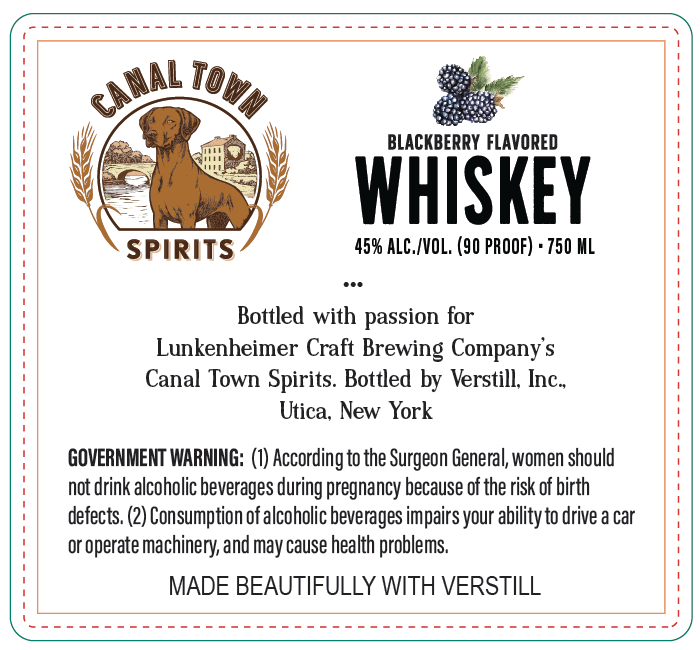
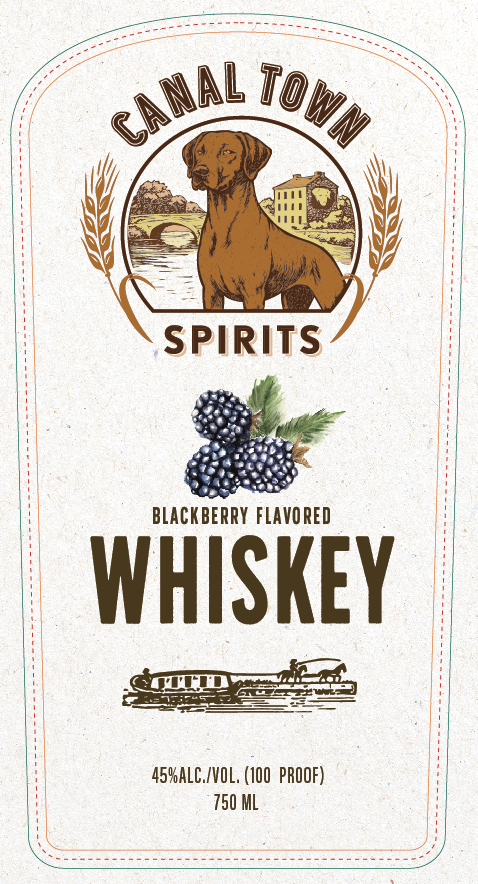

# TTB COLA Label Images - TTBID 26156001000213

**Brand Name:** CANAL TOWN

**Issue Date:** 06/17/2026

**Origin Code:** 02

**Product Class/Type:** 149

**Source:** [TTB Public COLA Registry](https://ttbonline.gov/colasonline/viewColaDetails.do?action=publicFormDisplay&ttbid=26156001000213)

## Label Images

### Back Label

### Front Label

## Extracted Label Text

*Text extracted via OCR - may contain errors*

**Detected Proof:** 90

### Back Label

IOw
BLACKBERRY FLAVORED
WHISKEY
SPIRITS
45% ALC /VOL, (90 PROOF)
750 HL
Bottled with passion for
Lunkenheimer Craft Brewing Company $
Canal Town Spirits. Bottled by Verstill; Inc_
Utica; New York
GOVERNMENT WARMING: (1) According to the Surgeon General, women should
not drink alcoholic beverages during pregnancy because of the risk of birth
defects. (2) Consumption ofalcoholic beverages impairs your abilityto drive a car
or operate machinery, and may cause health problems
MADE BEAUTIFULLY WITH VERSTILL
canal

### Front Label

Srey

faeteoai ats

a pnt T0y Y%y

/

\

(

a

mm dt A

SPIRIT

BLACKBER

WiSkey

SGT yas

= Seed

OE

——=—

AS%ALCIVOL, (100 PROOF)

Eee oa Gane aaa eee
