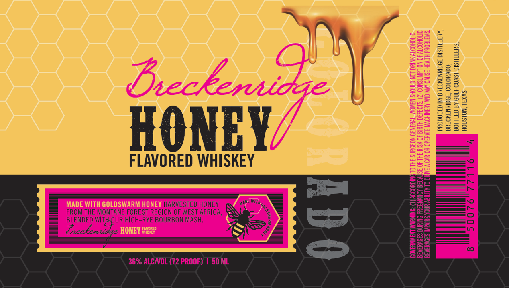

# TTB COLA Label Images - TTBID 26156001000231

**Brand Name:** BRECKENRIDGE

**Fanciful Name:** HONEY

**Issue Date:** 06/10/2026

**Origin Code:** 44

**Product Class/Type:** 149

**Source:** [TTB Public COLA Registry](https://ttbonline.gov/colasonline/viewColaDetails.do?action=publicFormDisplay&ttbid=26156001000231)

## Label Images

### Front Label

## Extracted Label Text

*Text extracted via OCR - may contain errors*

**Detected Proof:** 72

### Front Label

HONEY

FLAVORED WHISKEY

HARVESTED HONEY EET

FROM THE MONTANE FOREST REGION OF WEST AFRICA, %
BLENDED og HIGH-RYE BOURBON MASH,

v

36% ALC/VOL (72 PROOF) | 50 ML

BEVERAGES IMPAIRS. YOUR ABILITY TO DR§

GOVERNMENT WARNING: (1) ACCORDING

[BEVERAGES DURING PRE

| 4

50076 77116
