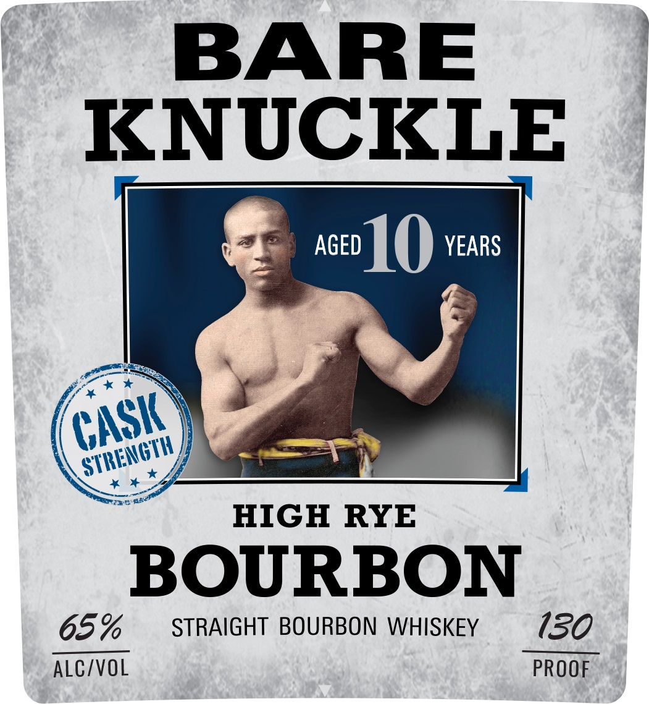
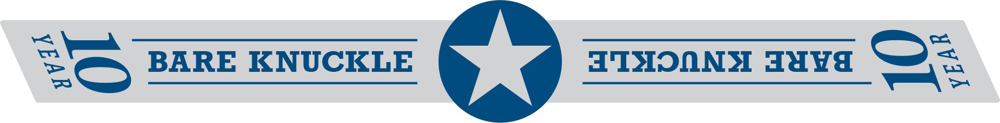
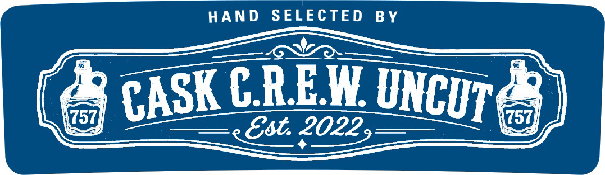

# TTB COLA Label Images - TTBID 26156001000240

**Brand Name:** BARE KNUCKLE

**Fanciful Name:** HIGH RYE

**Issue Date:** 06/22/2026

**Origin Code:** 05

**Product Class/Type:** 101

**Source:** [TTB Public COLA Registry](https://ttbonline.gov/colasonline/viewColaDetails.do?action=publicFormDisplay&ttbid=26156001000240)

## Label Images

### Label 1

### Label 3

### Label 5

## Extracted Label Text

*Text extracted via OCR - may contain errors*

**Detected Proof:** 130
**Detected Age:** 10 Years

### Label 1

BARE
KNUCKLE
AGED
10
YEARS
HIGH RYE
BOURBON
65%
STRAIGHT BOURBON WHISKEY
130
ALC/VOL
PROOF
CASK
STRENGTH,

### Label 3

aaa ENUGEEE Toone
=, Se BARE KNUCKLE ey a TXONNS Java ey

### Label 5

HAND
SELECTED
B Y
CREW
757
757
Est. 20229
UNCUT
CASK
