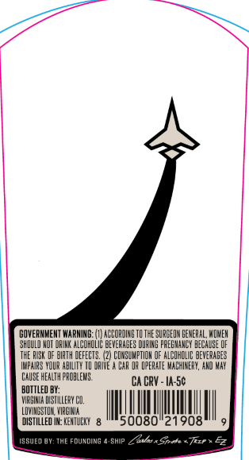
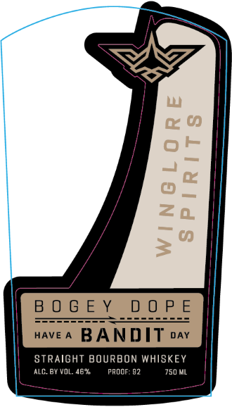

# TTB COLA Label Images - TTBID 26156001000271

**Brand Name:** WINGLORE SPIRITS

**Fanciful Name:** BOGEY DOPE STRAIGHT BOURBON WHISKEY

**Issue Date:** 06/11/2026

**Origin Code:** 05

**Product Class/Type:** 101

**Source:** [TTB Public COLA Registry](https://ttbonline.gov/colasonline/viewColaDetails.do?action=publicFormDisplay&ttbid=26156001000271)

## Label Images

### Back Label

### Front Label

## Extracted Label Text

*Text extracted via OCR - may contain errors*

### Back Label

BOVERMMENT WARMINE: (U) ACBORDIRE TC THE SURGEDN BEneral; WIWEH
SH ILLI HOT ORLHK ALCOHCLIC BEVERASES DirIk $ PREE ANCY DECAUS: @F
TFE Rusk  DF BHRTH DEFECTS: 42p COMSUMPTICH OF ALCUHCLE DEVERABES
Your
DAIE _
BAR IR DPERATE MABHIRERY, AHD NaY
Cause HealTh problews
CRV - Ia-5c
BOTTLed BY:
VIR HIkLA MISIULLERY CI.
LIMMESTIR, VIRGIU
DISTILLED IM: KEHILEKT
'0080"21908
ISSue0 0y; ThE Fou"dinG & ship Zava*Spete * Trr?
Wpars

### Front Label

BOGEY DOPE

waver BANDIT 4

STRAIGHT BOURBON WHISKEY
2 ————
