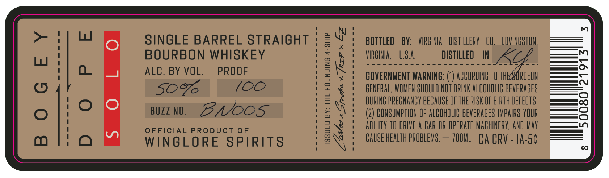
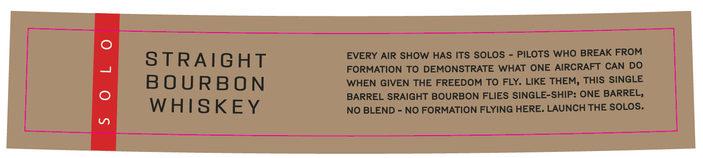

# TTB COLA Label Images - TTBID 26156001000280

**Brand Name:** WINGLORE SPIRITS

**Fanciful Name:** BOGEY DOPE SOLO

**Issue Date:** 06/10/2026

**Origin Code:** 05

**Product Class/Type:** 101

**Source:** [TTB Public COLA Registry](https://ttbonline.gov/colasonline/viewColaDetails.do?action=publicFormDisplay&ttbid=26156001000280)

## Label Images

### Label 1

### Label 2

## Extracted Label Text

*Text extracted via OCR - may contain errors*

### Label 1

SINGLE BARREL STRAIGHT
BOURBON WHISKEY
ALC. BY VOL. PROOF

SOV /OO
BUZZIN. BAOOS

OFFICIAL PRODUCT OF

WINGLORE SPIRITS

ISSUED BY: THE FOUNDING 4-SHIP

W
i
N

BOTTLED BY: VIRGINIA DISTILLERY CO. LOVINGSTON,
VIRGINIA, U.S.A. — DISTILLED IN

GOVERNMENT WARNING: (1) ACCORDING TO THEASCREEON
GENERAL, WOMEN SHOULD NOT DRINK ALCOHOLIC BEVERAGES
DURING PREGNANCY BECAUSE OF THE RISK OF BIRTH DEFECTS,
(2) CONSUMPTION OF ALCOHOLIC BEVERAGES IMPAIRS YOUR
ABILITY TO ORIVE A CAR OR OPERATE MACHINERY, AND MAY
CAUSE HEALTH PROBLEWS.— 70OML CA CRV - IA-5¢

### Label 2

EVERY AIR SHOW HAS ITS SOLOS
PILOTS WHO BREAK FROM
S TRAIGHT
FORMATION TO DEMONSTRATE
WHAT ONE
AIRCRAFT CAN DO
BOURBON
WHEN GIVEN THE FREEDOM TO FLY. LIKE THEM, THIS SINGLE
BARREL SRAIGHT BOURBON FLIES SINGLE-SHIP: ONE BARREL,
WHISKEY
NO BLEND
NO FORMATION FLYING HERE: LAUNCH THE SOLOS.
