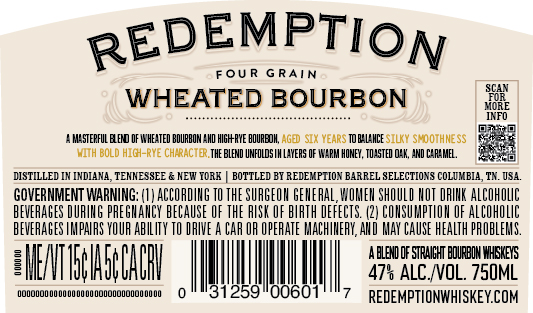
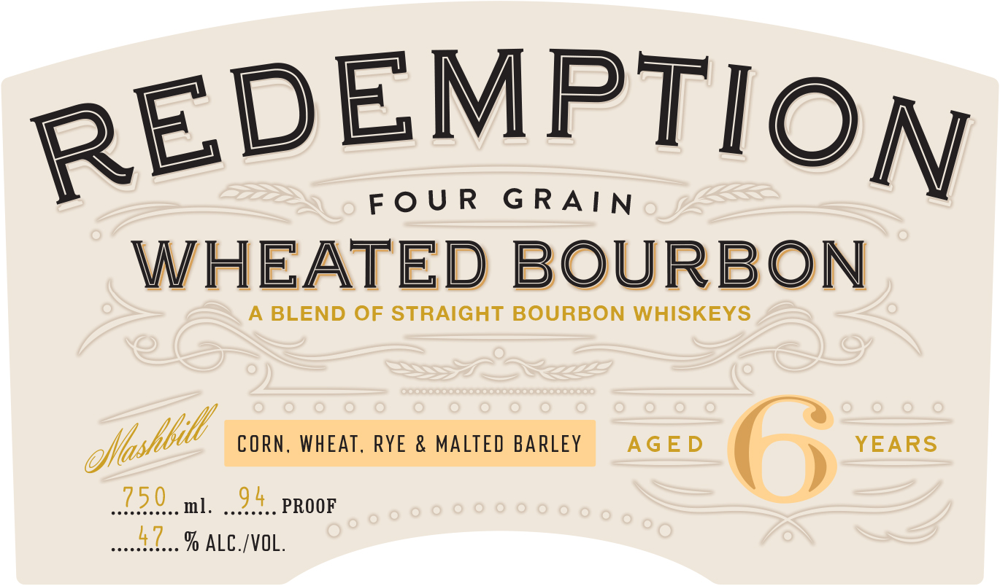
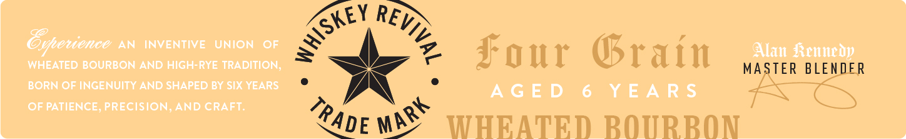

# TTB COLA Label Images - TTBID 26156001000351

**Brand Name:** REDEMPTION

**Issue Date:** 06/17/2026

**Origin Code:** 43

**Product Class/Type:** 121

**Source:** [TTB Public COLA Registry](https://ttbonline.gov/colasonline/viewColaDetails.do?action=publicFormDisplay&ttbid=26156001000351)

## Label Images

### Back Label

### Front Label

### Label 2

## Extracted Label Text

*Text extracted via OCR - may contain errors*

**Detected Proof:** 94

### Back Label

REDEMPTION
FOU R
G RAIN
WHEATED BOURBON
JEE
IKFO
H4STEPFUL EERD DF WHEATED BOURBOM AHD HIGh RYE BOUREOK Aged SiX WeaRS TOB4L4HCE SiLK # SMOOThMESS
MITH BOLd hiC-RwE ChARACTER THE BLEND UNFOLDS L LAYERS OF IAPH HOMEY , TOJSTED O4K, JND C4R4HEL _
DISTILLED
[NDIAN4, TENNESSEE
HEW TorK
BOTTLED BY REDEMPTION BARREL SELECTIONS COLUXBIA
084
GOVERNMENT WARNING;
ACCORDIHG
THE SURGEOH GEHERAL, WOHEH ShOULD HOT DRIHK ALCOhOLC
BEVERAGES DURIHG PREGHAHCY BECAUSE OF THE RISK OF BIRTH DEFECTS. (21 COHSUMPTLOH OF alCOhOLIC
BEVERAGES LKLPHLRS YOUR ABILITY
IRIVE a CAR OF OPERATE MACHIHERY,AHD Hay CAUSE HEALTH PPOBLERS.
A BLEHD DF STPAILHT BDURBOH WHEKEYS
OEMIBHSpBAIH
47% ALC IOL. 750ML
HUUAAALLALAMMMM
REDEMPTIONWHISKEYCOM

### Front Label

REDEMPTIOg

FOUR GRAIN

WHEATED BOURBON

A BLEND OF STRAIGHT BOURBON WHISKEYS

flbee CORN. WHEAT, RYE & MALTED BARLEY AGED OG YEARS

230 mt. 24. PROOF

### Label 2

AN
NVENTIE
UmION
OF
WHEATED BOURBON AND HIGh-RYE TRADITION;
f our
Orain
MASTER BLEWDFR
BORN OF INGENUITY AND SHAPED BY SIX YEARS
A G E D
6
Y E A R $
OF PATIENCE; PRECISION
AWDCRAFT
WHEATED ROTRROn
WHISkep
REviVAI
Orotioneo
MARK
TRADE
