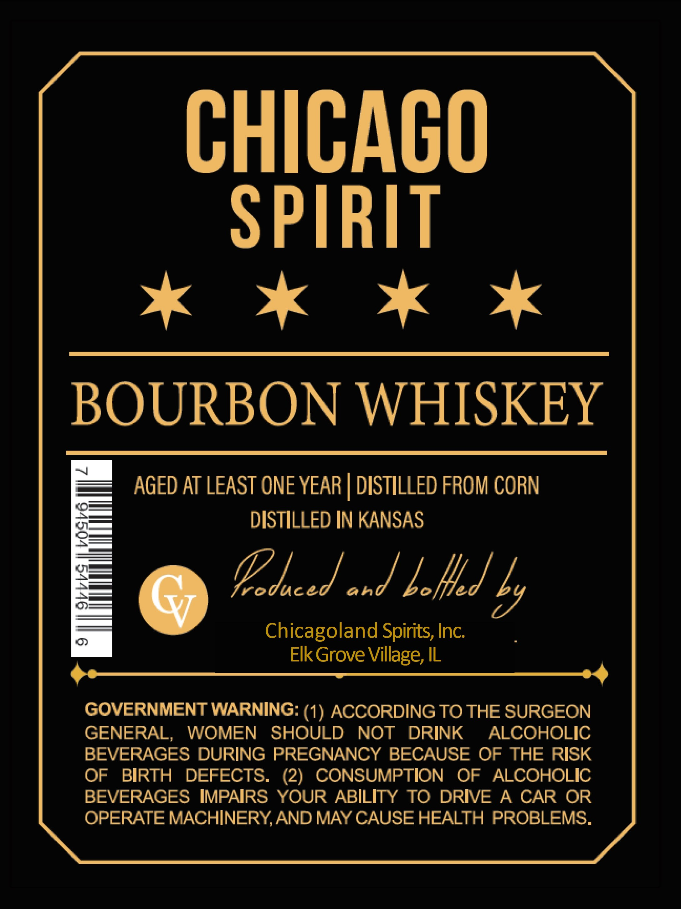
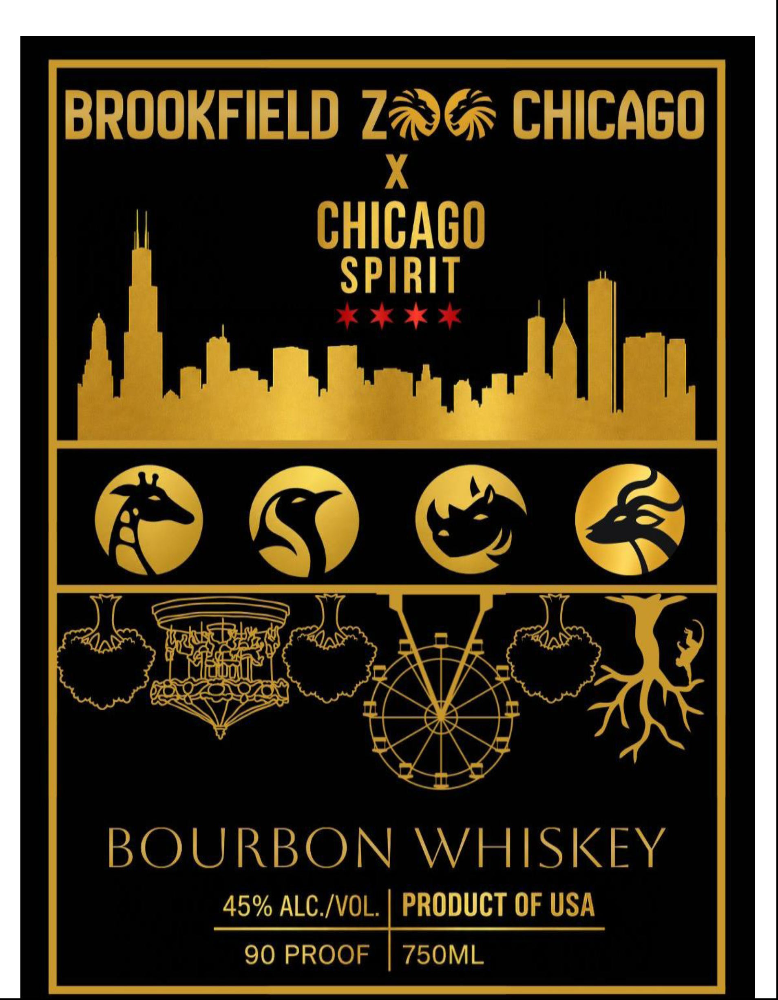

# TTB COLA Label Images - TTBID 26156001000450

**Brand Name:** BROOKFIELD ZOO CHICAGO X CHICAGO SPIRIT

**Issue Date:** 06/10/2026

**Origin Code:** 04

**Product Class/Type:** 141

**Source:** [TTB Public COLA Registry](https://ttbonline.gov/colasonline/viewColaDetails.do?action=publicFormDisplay&ttbid=26156001000450)

## Label Images

### Back Label

### Front Label

## Extracted Label Text

*Text extracted via OCR - may contain errors*

**Detected Proof:** 90

### Back Label

CHICAGO
SPIRIT
kk Ok Ok

BOURBON WHISKEY

AGED AT LEAST ONE YEAR | DISTILLED FROM CORN
DISTILLED IN KANSAS

fom Eecd and poled f

Chicagoland Spirits, Inc.
Elk Grove Village, IL

GOVERNMENT WARNING: (1) ACCORDING TO THE SURGEON
GENERAL, WOMEN SHOULD NOT DRINK ALCOHOLIC
BEVERAGES DURING PREGNANCY BECAUSE OF THE RISK
OF BIRTH DEFECTS. (2) CONSUMPTION OF ALCOHOLIC
BEVERAGES IMPAIRS YOUR ABILITY TO DRIVE A CAR OR
OPERATE MACHINERY, AND MAY CAUSE HEALTH PROBLEMS.

### Front Label

BROOKFIELD 2
chicaGO
CHICACO
SPIRIT
BOURBON
WHISKEY
45% ALC /VOL.
PRODUCT OF USA
90 PROOF
750ML
