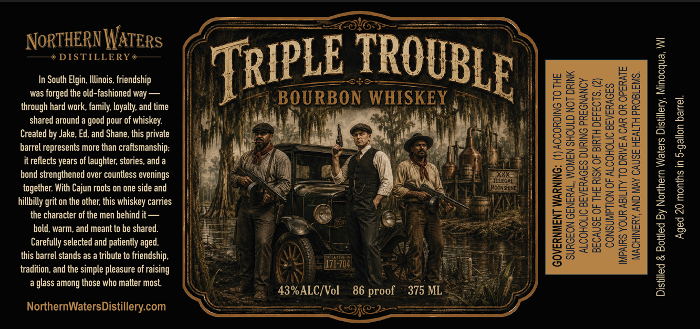

# TTB COLA Label Images - TTBID 26156001000463

**Brand Name:** TRIPLE TROUBLE

**Issue Date:** 06/10/2026

**Origin Code:** 48

**Product Class/Type:** 141

**Source:** [TTB Public COLA Registry](https://ttbonline.gov/colasonline/viewColaDetails.do?action=publicFormDisplay&ttbid=26156001000463)

## Label Images

### Label 1

## Extracted Label Text

*Text extracted via OCR - may contain errors*

**Detected Proof:** 86

### Label 1

NoRTHERN WATERs
5
DISTILLERY
In South Elgin, Illinois, friendship
TRIPLE
22
was forged the old-fashioned way
BOURBON WHISKEY
1
1
through hard work, family loyalty: and time
2
0
M
g
shared around a good pour of
fwhiskey:
I
Created by Jake, Ed, and Shane, this private
8
1
5
barrel represents more than craftsmanship;
3
2
itreflects years of laughter; stories, and a
3
3
2
bond strengthened over countless evenings
3
together With Cajun roots on one side and
Mlleshke
0
4
09
hillbilly grit on the other; this whiskey carries
8
1
2
8
thecraracter aotdhegaer behgdared
Jon
M
6
2
Carefully selected and patiently aged,
MuhuplA
this barrel stands as a tribute to friendship,
171-704
tradition, and the simple pleasure of
glass among those who matter most
3
43%ALC/Vol
86
375 ML
NorthernWatersDistillery com
TROUBLE
I
f raising
proof
