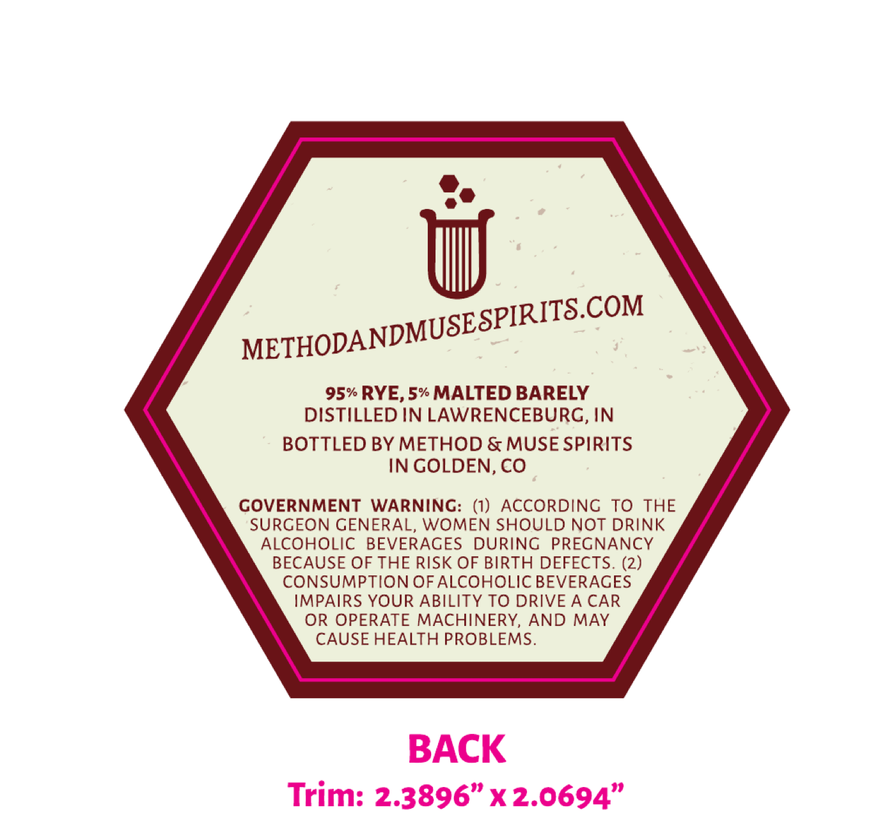
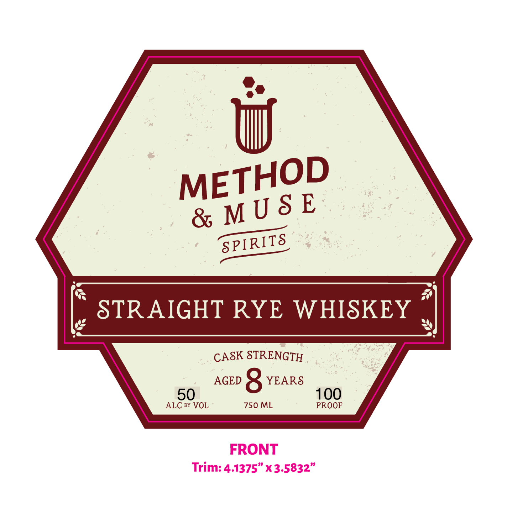

# TTB COLA Label Images - TTBID 26156001000645

**Brand Name:** METHOD & MUSE SPIRITS

**Issue Date:** 06/12/2026

**Origin Code:** 13

**Product Class/Type:** 102

**Source:** [TTB Public COLA Registry](https://ttbonline.gov/colasonline/viewColaDetails.do?action=publicFormDisplay&ttbid=26156001000645)

## Label Images

### Back Label

### Front Label

## Extracted Label Text

*Text extracted via OCR - may contain errors*

**Detected Age:** 8 Years

### Back Label

SPIRITSCOM
95% RYE, 5% MALTED BARELY
DISTILLED IN LAWRENCEBURG, IN
BOTTLED BY METHOD & MUSE SPIRITS
IN GOLDEN, CO
COVERNMENT
WARNINC: (1) ACCORDING
TO THE
SURGEON GENERAL, WOMEN SHOULD NOT DRINK
ALCOHOLIC
BEVERAGES
DURING
PREGNANCY
BECAUSE OF THE RISK OF BIRTH DEFECTS. (2)
CONSUMPTION OF ALCOHOLIC BEVERAGES
IMPAIRS YOUR ABILITY TO DRIVE A CAR
OR OPERATE MACHINERY,
AND MAY
CAUSE HEALTH PROBLEMS.
BACK
Trim: 2.3896" X2.0694"
METHODANDMUSEZ

### Front Label

o®

HOD

MET

USE

& M

SPIRITS

) STRAIGHT RYE WHISKEY :

CASK STRENGTH

AGED 8 YEARS

ALC 8Y VOL

750 ML

PROOF

00

FRONT

Trim: 4.1375” x 3.5832”
