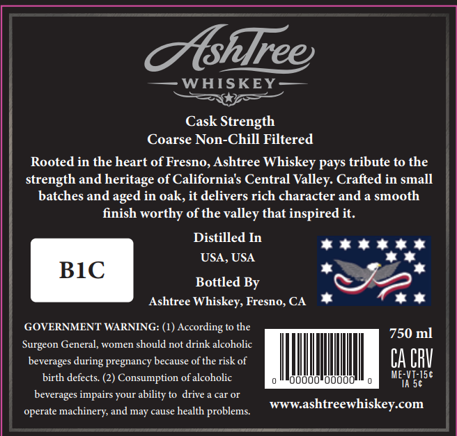
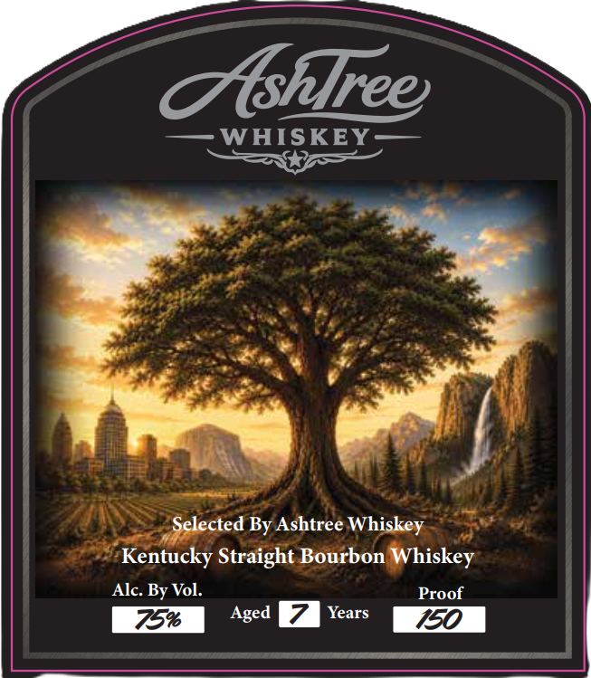

# TTB COLA Label Images - TTBID 26156001000673

**Brand Name:** ASHTREE WHISKEY

**Issue Date:** 06/11/2026

**Origin Code:** 01

**Product Class/Type:** 101

**Source:** [TTB Public COLA Registry](https://ttbonline.gov/colasonline/viewColaDetails.do?action=publicFormDisplay&ttbid=26156001000673)

## Label Images

### Back Label

### Front Label

## Extracted Label Text

*Text extracted via OCR - may contain errors*

**Detected Proof:** 150

### Back Label

Tshlree
WHISKEY
Cask Strength
Coarse Non-Chill Filtered
Rooted in the heart of Fresno, Ashtree Whiskey pays tribute to the
strength and heritage of Californias Central Valley: Crafted in small
batches and
in oak, it delivers rich character and a smooth
finish worthy of the valley that inspired it.
Distilled In
USA, USA
BIC
Bottled By
Ashtree Whiskey, Fresno, CA
GOVERNMENT WARNING: (1) According to the
750 ml
Surgeon General, women should not drink alcoholic
beverages
pregnancy because of the risk of
CA CbV
birth defects
Consumption of alcoholic
UUUUU
UUUUU
ME-VT-ISc
Ia 56
beverages impairs your ability to drive
car Or
operate machinery;
may cause health
problems:
WWWashtreewhiskey com
aged
during
and

### Front Label

Oshlree
WHISKEY
Selected By Ashtree Whiskey
Kentucky Straight Bourbon Whiskey
Alc. By Vol.
Proof
75%
Aged
Years
150
