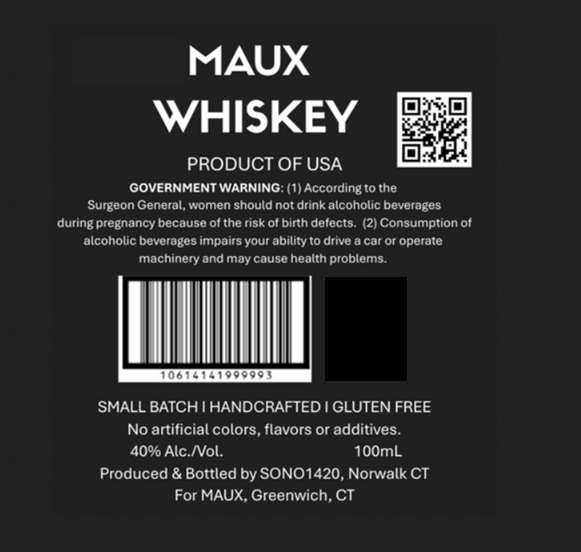

# TTB COLA Label Images - TTBID 26157001000034

**Brand Name:** MAUX

**Issue Date:** 06/11/2026

**Origin Code:** 14

**Product Class/Type:** 140

**Source:** [TTB Public COLA Registry](https://ttbonline.gov/colasonline/viewColaDetails.do?action=publicFormDisplay&ttbid=26157001000034)

## Label Images

### Back Label

### Label 1

## Extracted Label Text

*Text extracted via OCR - may contain errors*

**Detected Proof:** 80

### Back Label

Congratulations Julie and Jim
on your Wedding Day
29,2026
May

### Label 1

MAUX
WHISKEY
PRODUCT OF USA
GOVERNMENT WARNING: (1) According to the
Surgeon General, women should not drink alcoholic beverages
during pregnancy because of the risk of birth defects:
2) Consumption of
alcoholic beverages impairs your ability t0 drive
car or operate
machinery and may cause health problems.
SMALL BATCH IHANDCRAFTED | GLUTEN FREE
No artificial colors, flavors or additives.
40% Alc NVol:
10OmL
Produced & Bottled by SONO1420, Norwalk CT
For MAUX, Greenwich; CT
