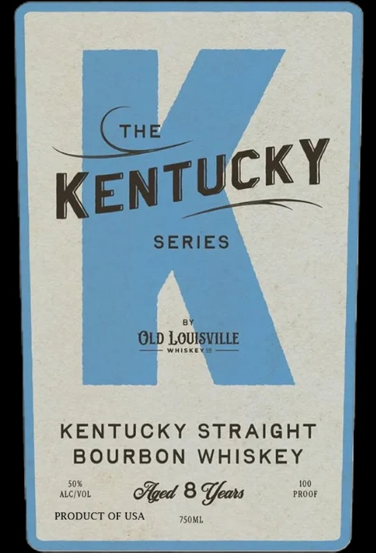

# TTB COLA Label Images - TTBID 26158001000065

**Brand Name:** KENTUCKY

**Fanciful Name:** AGED 8 YEARS

**Issue Date:** 06/11/2026

**Origin Code:** 01

**Product Class/Type:** 101

**Source:** [TTB Public COLA Registry](https://ttbonline.gov/colasonline/viewColaDetails.do?action=publicFormDisplay&ttbid=26158001000065)

## Label Images

### Label 1

### Label 2

## Extracted Label Text

*Text extracted via OCR - may contain errors*

### Label 1

THE
SERIES
OLD LOUISVILLE
Whiskd
KENTUCKY STRAiGHT
BOURBON
WhISKEY
5056
10O
ALCIVOL
cZaed 8 Iear
PROOF
PRODUCT OF USA
750ML
KENTUCKY

### Label 2

RE-IMPORTED BY: CONNOISSEUR WINES & SPIRITS CALIFORNIA NAPA,CA

"OBTAINED FROM A PRIVATE COLLECTION"

CACASHED REFUND CACRV

GOVERNMENT WARNING: (1) ACCORDING TO THE SURGEON GENERAL, WOMEN

SHOULD NOT DRINK ALCOHOLIC BEVERAGES DURING PREGNANCY BECAUSE OF THE

RISK OF BIRTH DEFECTS. (2) CONSUMPTION OF ALCOHOLIC BEVERAGES IMPAIRS YOUR

ABILITY TO DRIVE A CAR OR OPERATE MACHINERY, AND MAY CAUSE HEALTH PROBLEMS.
