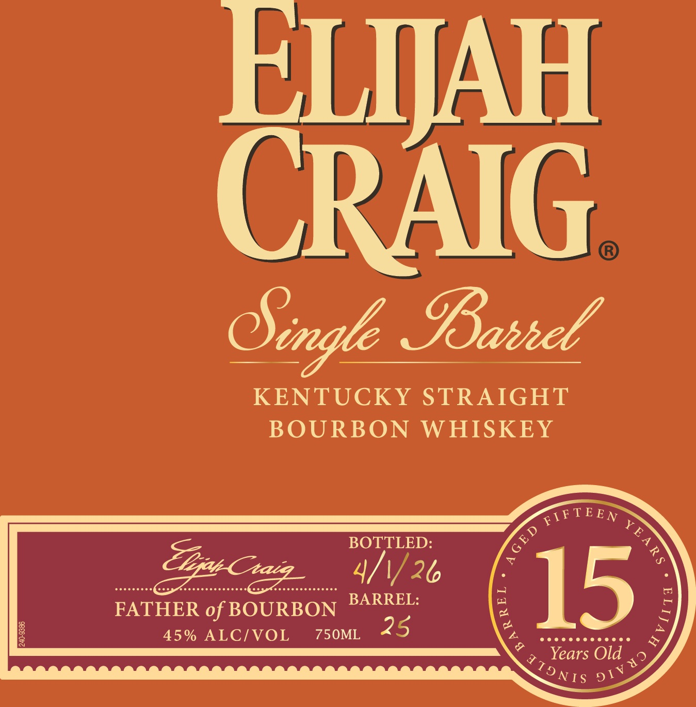

# TTB COLA Label Images - TTBID 26158001000067

**Brand Name:** ELIJAH CRAIG

**Fanciful Name:** 15 YEARS OLD

**Issue Date:** 06/11/2026

**Origin Code:** 01

**Product Class/Type:** 101

**Source:** [TTB Public COLA Registry](https://ttbonline.gov/colasonline/viewColaDetails.do?action=publicFormDisplay&ttbid=26158001000067)

## Label Images

### Label 1

### Label 2

## Extracted Label Text

*Text extracted via OCR - may contain errors*

**Detected Proof:** 90
**Detected Age:** 25 Years

### Label 1

EIJAH
CRAIG
SBahhel
KENTUCKY STRAIGHT
BOURBON
WHISKEY
FIFTEEN
BOTTLED:
7p
ZEra Chazz
4/1/26
FATHER of BOURBON
BARREL:
15
F
8
45% ALCIVOL
750ML
25
Years Old
CSigle_
YE
3
1
2
42
TT9 NIS
91 V

### Label 2

RE-IMPORTED BY: CONNOISSEUR WINES & SPIRITS CALIFORNIA NAPA,CA

"OBTAINED FROM A PRIVATE COLLECTION"

CACASHED REFUND CACRV

GOVERNMENT WARNING: (1) ACCORDING TO THE SURGEON GENERAL, WOMEN

SHOULD NOT DRINK ALCOHOLIC BEVERAGES DURING PREGNANCY BECAUSE OF THE

RISK OF BIRTH DEFECTS. (2) CONSUMPTION OF ALCOHOLIC BEVERAGES IMPAIRS YOUR

ABILITY TO DRIVE A CAR OR OPERATE MACHINERY, AND MAY CAUSE HEALTH PROBLEMS.
