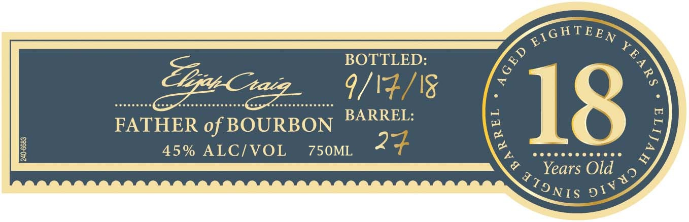
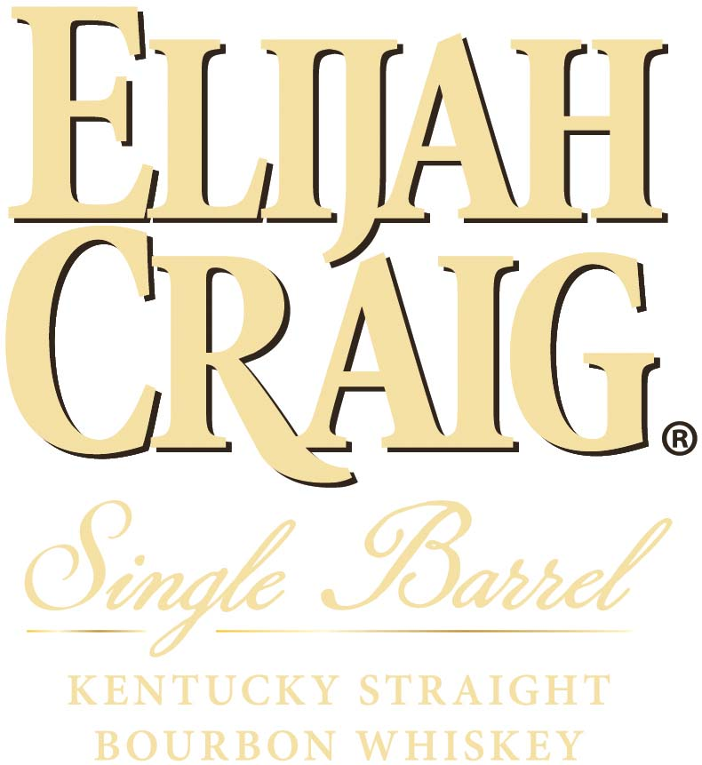
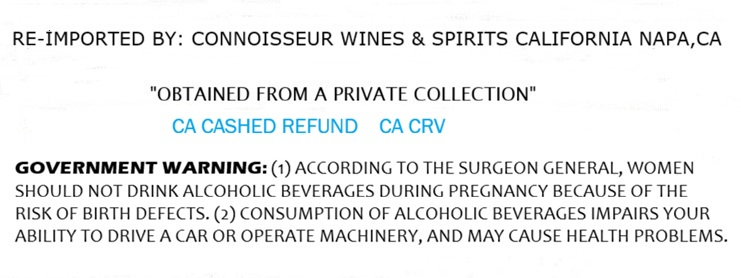

# TTB COLA Label Images - TTBID 26158001000068

**Brand Name:** ELIJAH CRAIG

**Fanciful Name:** 18 YEARS OLD

**Issue Date:** 06/11/2026

**Origin Code:** 01

**Product Class/Type:** 101

**Source:** [TTB Public COLA Registry](https://ttbonline.gov/colasonline/viewColaDetails.do?action=publicFormDisplay&ttbid=26158001000068)

## Label Images

### Label 1

### Label 2

### Label 3

## Extracted Label Text

*Text extracted via OCR - may contain errors*

*1 image(s) excluded: text did not meet readability threshold*

### Label 2

ELIJFL
GPAIC
OBahhel
KENTUCKT STRAIGHT
BOURBON
WHISKEY
Oigle

### Label 3

RE-IMPORTED BY: CONNOISSEUR WINES & SPIRITS CALIFORNIA NAPA,CA

"OBTAINED FROM A PRIVATE COLLECTION"

CACASHED REFUND CACRV

GOVERNMENT WARNING: (1) ACCORDING TO THE SURGEON GENERAL, WOMEN

SHOULD NOT DRINK ALCOHOLIC BEVERAGES DURING PREGNANCY BECAUSE OF THE

RISK OF BIRTH DEFECTS. (2) CONSUMPTION OF ALCOHOLIC BEVERAGES IMPAIRS YOUR

ABILITY TO DRIVE A CAR OR OPERATE MACHINERY, AND MAY CAUSE HEALTH PROBLEMS.
