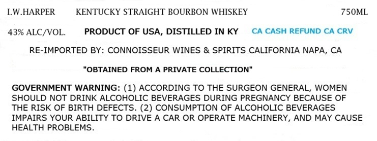
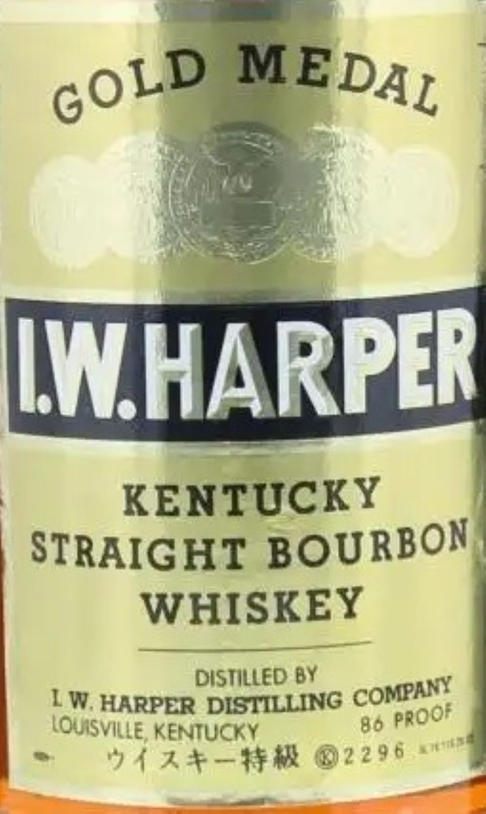

# TTB COLA Label Images - TTBID 26158001000076

**Brand Name:** I.W.HARPER

**Fanciful Name:** GOLD MEDAL

**Issue Date:** 06/12/2026

**Origin Code:** 01

**Product Class/Type:** 101

**Source:** [TTB Public COLA Registry](https://ttbonline.gov/colasonline/viewColaDetails.do?action=publicFormDisplay&ttbid=26158001000076)

## Label Images

### Label 1

### Label 2

## Extracted Label Text

*Text extracted via OCR - may contain errors*

**Detected Proof:** 86

### Label 1

1.W.HARPER

KENTUCKY STRAIGHT BOURBON WHISKEY

7S50ML

43% ALC/VOL.

PRODUCT OF USA, DISTILLED INKY CA CASH REFUND CA CRV

RE-IMPORTED BY: CONNOISSEUR WINES & SPIRITS CALIFORNIA NAPA, CA

“OBTAINED FROM A PRIVATE COLLECTION"

GOVERNMENT WARNING: (1) ACCORDING TO THE SURGEON GENERAL, WOMEN

SHOULD NOT DRINK ALCOHOLIC BEVERAGES DURING PREGNANCY BECAUSE OF

THE RISK OF BIRTH DEFECTS. (2) CONSUMPTION OF ALCOHOLIC BEVERAGES

IMPAIRS YOUR ABILITY TO DRIVE A CAR OR OPERATE MACHINERY, AND MAY CAUSE

HEALTH PROBLEMS.

### Label 2

IWHARPER
KENTUCKY
STRAIGHT BOURBON
WHISKEY
DISTILLED BY
IW, HARPER DISTILLING
LQUISVILLE; KENTUCKY
80
2 4 3+-#m 02296
MEDAL
GOLD
COMPANY
PROOF
