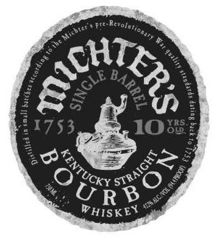
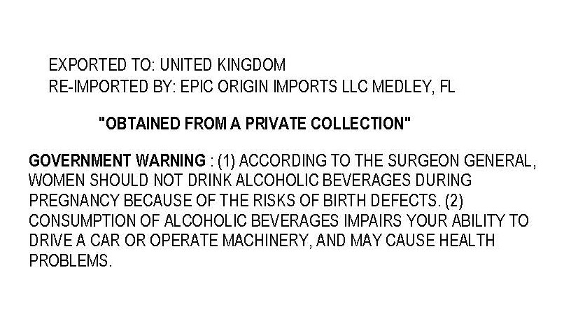

# TTB COLA Label Images - TTBID 26158001000098

**Brand Name:** MICHTER'S

**Fanciful Name:** 10 YRS OLD

**Issue Date:** 06/11/2026

**Origin Code:** 16

**Product Class/Type:** 101

**Source:** [TTB Public COLA Registry](https://ttbonline.gov/colasonline/viewColaDetails.do?action=publicFormDisplay&ttbid=26158001000098)

## Label Images

### Front Label

### Label 2

## Extracted Label Text

*Text extracted via OCR - may contain errors*

*1 image(s) excluded: text did not meet readability threshold*

### Label 2

EXPORTED TO: UNITED KINGDOM
RE-IMPORTED BY: EPIC ORIGIN IMPORTS LLC MEDLEY, FL
"OBTAINED FROMA PRIVATE COLLECTION"
GOVERNMENT WARNING : (1) ACCORDING TO THE SURGEON GENERAL,
WOMEN SHOULD NOT DRINK ALCOHOLIC BEVERAGES DURING
PREGNANCY BECAUSE OF THE RISKS OF BIRTH DEFECTS. (2)
CONSUMPTION OF ALCOHOLIC BEVERAGES IMPAIRS YOUR ABILITY TO
DRIVEA CAR OR OPERATE MACHINERY, AND MAY CAUSE HEALTH
PROBLEMS .
