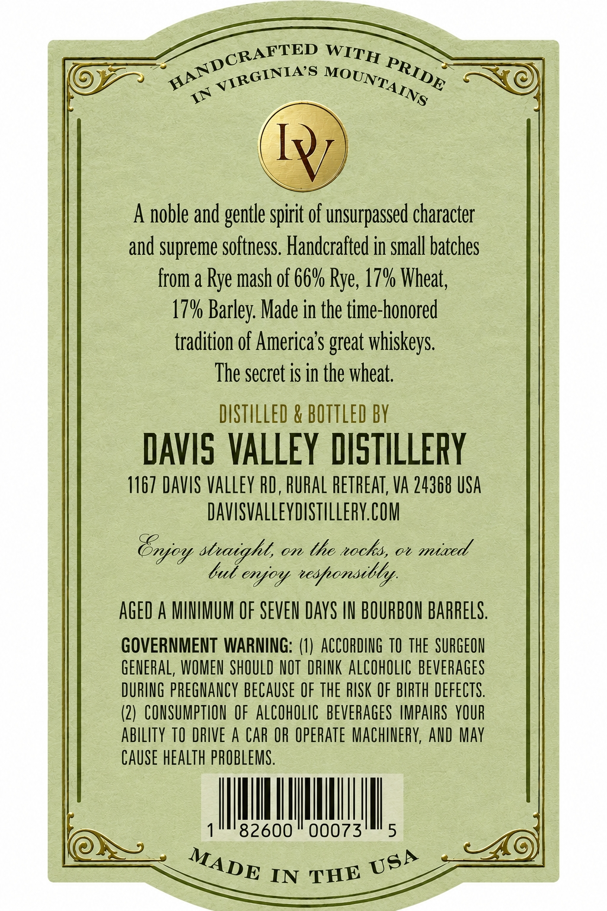

# TTB COLA Label Images - TTBID 26159001000041

**Brand Name:** OWEN COX

**Fanciful Name:** VIRGINIA MOUNTAIN RYE

**Issue Date:** 06/22/2026

**Origin Code:** 05

**Product Class/Type:** 140

**Source:** [TTB Public COLA Registry](https://ttbonline.gov/colasonline/viewColaDetails.do?action=publicFormDisplay&ttbid=26159001000041)

## Label Images

### Back Label

## Extracted Label Text

*Text extracted via OCR - may contain errors*

### Back Label

IT
noble and gentle spirit of unsurpassed character
and supreme softness. Handcrafted in small batches
from a Rye mash of 66% Rye, 17V Wheat;
17% Barley; Made in the time-honored
tradition 0f America $ great whiskeys.
The secret is in the wheat;
DISTILLED & BOTTLED BY
DAvIS VALLEY DISTILLERY
1167 DAVIS Valley RD, buRAL RETREaT, Va 24368 USA
DavisvalleydastilleRYCOM
Tnyoy snaight,
on
the %ocks,
ob
miaed
but enjoy reshonsibly:
AGED A MMIMUM OF SEVEN DaYS IN BOURBON BARRELS.
GOVERNMENT WARNING: (1)  ACCORDING TO thE   SURGEON
GENERAL, WOMEN SHOULD NOT DRINK ALCOHOLIC beveRageS
DURING PREGNANCY BECAUSE €F thE RISK OF BIRTH DEFECTS.
(2)   CONSUMPTION OF  AlCOhOLIC beverAges IMPAIRS  YOUR
abiLITY TO DRIVE
CAR OR OpERATe MaChinERY, AND May
Cause hEalTh PROBLEMS.
82600
00073
5
IN
HANDCRAFTED
WITH
PRIDE
VIRGINIA'S
MOUNTAINS
MADE
USA
THE
