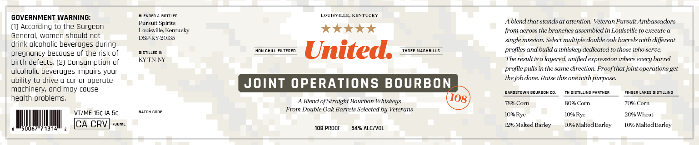
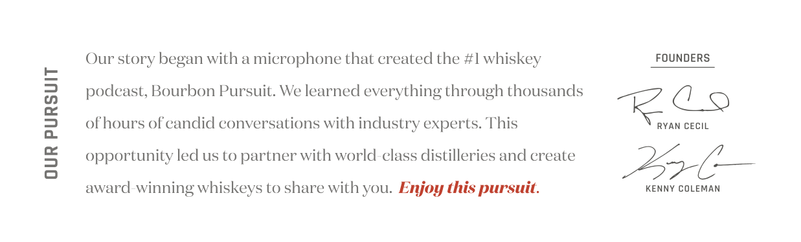

# TTB COLA Label Images - TTBID 26159001000068

**Brand Name:** UNITED

**Fanciful Name:** JOINT OPERATIONS BOURBON

**Issue Date:** 06/11/2026

**Origin Code:** 22

**Product Class/Type:** 121

**Source:** [TTB Public COLA Registry](https://ttbonline.gov/colasonline/viewColaDetails.do?action=publicFormDisplay&ttbid=26159001000068)

## Label Images

### Back Label

### Label 2

## Extracted Label Text

*Text extracted via OCR - may contain errors*

**Detected Proof:** 108

### Back Label

3124mem
Emttled
LOUISTILLE
KENTUCKI
GOVERNMENT WARNING:
Pursuit Spirits
Ablend that stands at attention Veteran Pursuit Ambassadors
According to the Surgeon
Louisville; Kentueky
from aeross the branehes assembled in Louisoille to execute
Generol; women should not
DSP-KY-20/35
single mission. Seleet multiple double ock barrels wxth difjerent
drink lcoholic beveroges during
pregnoncy becouse of the risk of
DISTILLED
CHILL Filtered
United:
THREE MASHBILLS
profiles and build a whiskey dedieated t0 those who serve:
birth defects (2) Consumption of
KY-TN-NY
The result is a layered, unified expression where every barrel
olcoholic beverages impoirs your
profile
in the same direetion Proof that joint operations get
obility to drive
cor Or operote
the job done: Raise this
with purpose:
mochinery, ond Moy couse
JOINT OPERATIONS BOURBON
bardstowmbqurbom
diStiLLING
ParTNEZ
Fingez LAKES DISTILLING
health problems;
Blend of' Straight Bourbon Whiskeys
7890 Corn
8096 Corn
7096 Corn
batcr Come
From Double Oak Barrels Seleeted by Veterans
VZME 15c IA 5c
I0% Rye
l0%o Rye
20% Wheat
CA CRV
Zooml
1290 Malted Barley
10% Malted Barley
10% Malted Barley
108 PROOF
54% ALC/VOL
pulls
Om
(108

### Label 2

Our story began with a micerophone that ereated the #I whiskey
FOUNDERS
podeast; Bourbon Pursuit: We learned everything through thousands
1
ofhours of eandid eonversations with industry experts: This
R6o
RYAN CECIL
8
opportunity led us to partner with world elass distilleries and ereate
276
award winning whiskeys to share with you: Enjoy this pursuit.
KENNY COLEMAN
