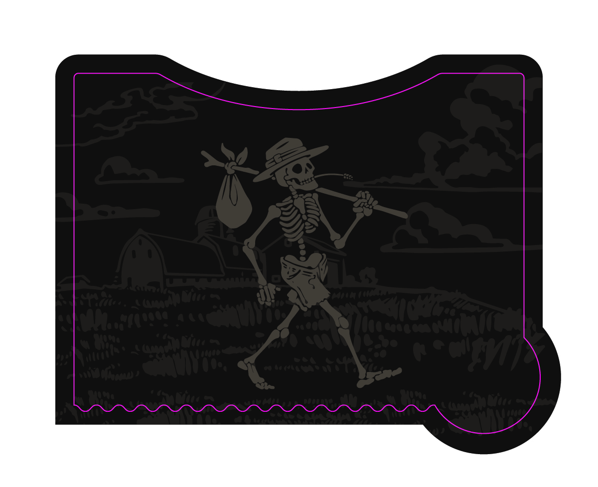
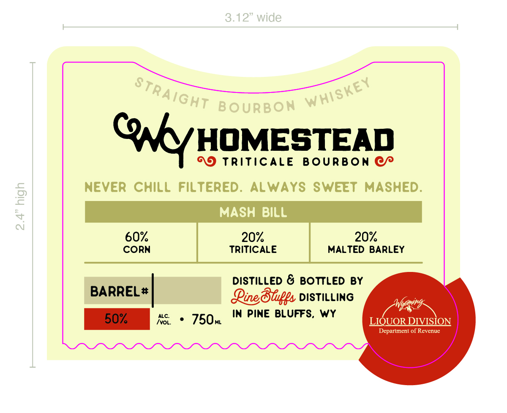

# TTB COLA Label Images - TTBID 26159001000261

**Brand Name:** PINE BLUFFS DISTILLING

**Fanciful Name:** WY HOMESTEAD TRITICALE BOURBON

**Issue Date:** 06/12/2026

**Origin Code:** 49

**Product Class/Type:** 101

**Source:** [TTB Public COLA Registry](https://ttbonline.gov/colasonline/viewColaDetails.do?action=publicFormDisplay&ttbid=26159001000261)

## Label Images

### Back Label

### Front Label

### Label 4

## Extracted Label Text

*Text extracted via OCR - may contain errors*

*1 image(s) excluded: text did not meet readability threshold*

**Detected Proof:** 120

### Front Label

3.12" wide
BOURBON
ONYyHOMESTEAD
TriticAle
Bourbon
NeveR
CHiLL
Filtered.
ALWAYS SWEET
MASHED:
2
MASH BiLl
4
60%
20
20%
CORN
TRITiCALE
MALTED BARLEY
DistilLed & BOTTLED By
BARREL #
Qineoblps DISTILLING
Wbomin
50%
ALC:
750w
In Pine BLUFFS,
wy
ivOL;
LIQUOR DIVISION
Department of Revenue
Straight
Whiskey

### Label 4

CYoMING
JiquoR DIVIsIoN
BARREL
Pick
