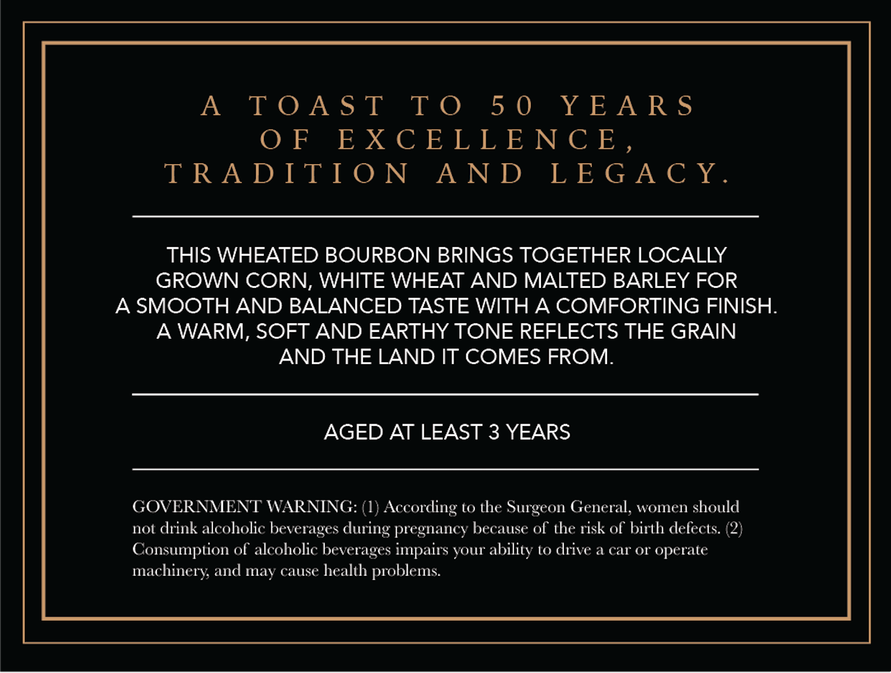
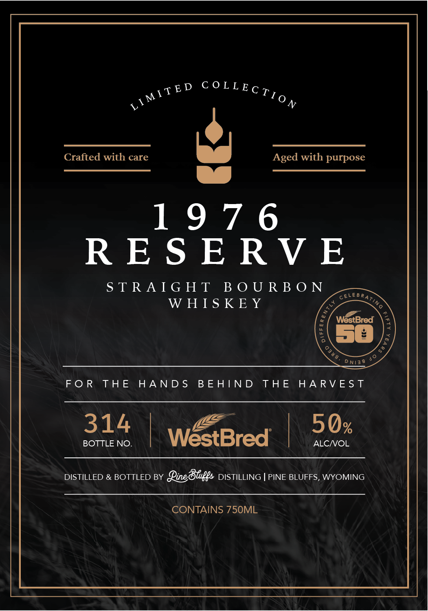

# TTB COLA Label Images - TTBID 26159001000269

**Brand Name:** PINE BLUFFS DISTILLING

**Fanciful Name:** 1976 RESERVE

**Issue Date:** 06/25/2026

**Origin Code:** 49

**Product Class/Type:** 101

**Source:** [TTB Public COLA Registry](https://ttbonline.gov/colasonline/viewColaDetails.do?action=publicFormDisplay&ttbid=26159001000269)

## Label Images

### Back Label

### Front Label

### Label 2

## Extracted Label Text

*Text extracted via OCR - may contain errors*

*1 image(s) excluded: text did not meet readability threshold*

**Detected Age:** 50 Years

### Back Label

A TOAST TO 50 YEARS

Ole Je XC © Je Jb IG 12, IN| 13, ,

TRADITION AND LEGACY

THIS WHEATED BOURBON BRINGS TOGETHER LOCALLY

GROWN CORN, WHITE WHEAT AND MALTED BARLEY FOR

A SMOOTH AND BALANCED TASTE WITH A COMFORTING FINISH

A WARM, SOFT AND EARTHY TONE REFLECTS THE GRAIN

AND THE LAND IT COMES FROM.

AGED AT LEAST 3 YEARS

GOVERNMENT WARNING: (1) According to the Surgeon General, women should

not drink alcoholic beverages during pregnancy because of the risk of birth defects. (2)

Consumption of alcoholic beverages impairs your ability to drive a car or operate

machinery, and may cause health problems.

### Front Label

sED COLLECy

ve

Crafted with care UJ Aged with purpose

es

1976

RESERVE

STRAIGHT BOURBON

WHISKEY

ceteeeay

AS

WestBred

50

oniae >

FOR THE HANDS BEHIND THE HARVEST

314

Ee.

5Qx

BOTTLE NO.

We

es

t

bred |

ALC/VOL

DISTILLED & BOTTLED BY Line Blips DISTILLING | PINE BLUFFS, WYOMING

CONTAINS 750ML
