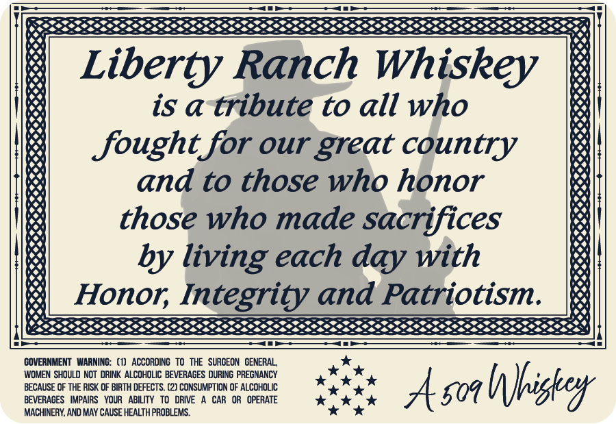
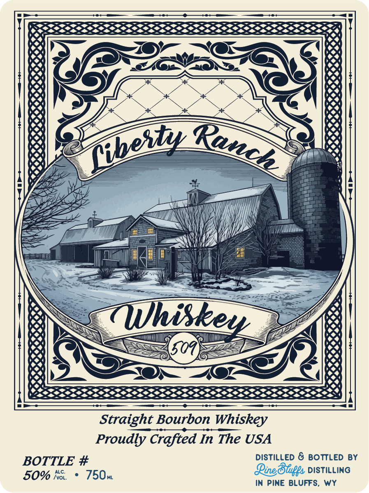

# TTB COLA Label Images - TTBID 26159001000275

**Brand Name:** PINE BLUFFS DISTILLING

**Fanciful Name:** LIBERTY RANCH WHISKEY 509

**Issue Date:** 06/11/2026

**Origin Code:** 49

**Product Class/Type:** 101

**Source:** [TTB Public COLA Registry](https://ttbonline.gov/colasonline/viewColaDetails.do?action=publicFormDisplay&ttbid=26159001000275)

## Label Images

### Back Label

### Front Label

## Extracted Label Text

*Text extracted via OCR - may contain errors*

*1 image(s) excluded: text did not meet readability threshold*

### Back Label

Liberty Ranch Whiskey
is a tribute to all who
fought for our _
country
and to those who honor
those who made sacrifices
by living each day with
Honor Integrity and Patriotism.
COVERNMENT WARNING: (1)   ACCOROING   To THE  SURGEON  GENERAL
WOMEN SHOULD NOT DRINK ALCOHOLIC BEVERACES DURING PREGNANCY
BECAUSE OF THE RISK OF BIRTH DEFECTS. (2) CONSUMPTION OF ALCOHOLIC
Ason Wnbigkex
BEVERACES
IMPAIRS   YOUR
ABILITY
DRIVE
CAR  OR   OPERATE
MACHINERY; AND MAY CAUSE HEALTH PROBLEMS.
great
