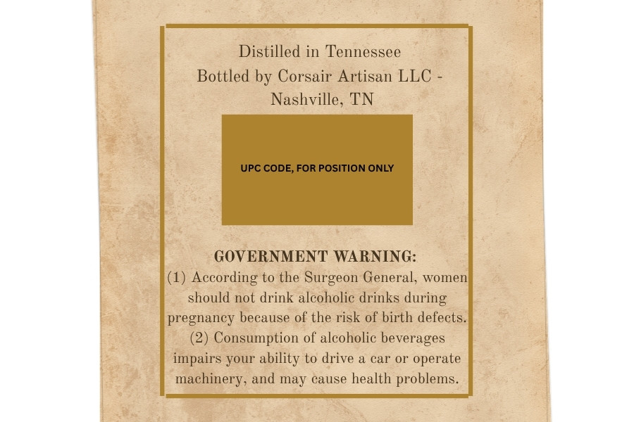
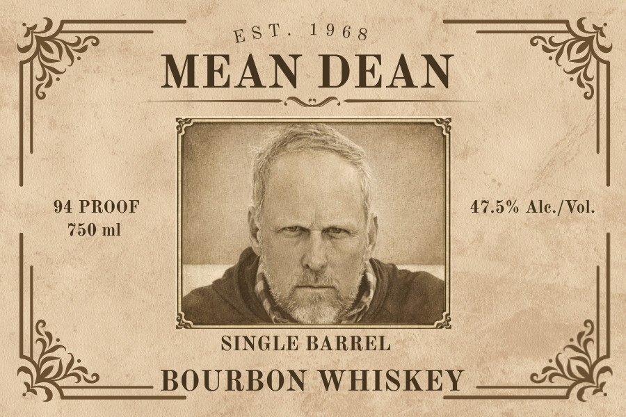

# TTB COLA Label Images - TTBID 26159001000323

**Brand Name:** MEAN DEAN

**Issue Date:** 06/29/2026

**Origin Code:** 43

**Product Class/Type:** 141

**Source:** [TTB Public COLA Registry](https://ttbonline.gov/colasonline/viewColaDetails.do?action=publicFormDisplay&ttbid=26159001000323)

## Label Images

### Back Label

### Front Label

## Extracted Label Text

*Text extracted via OCR - may contain errors*

**Detected Proof:** 94

### Back Label

Distilled in Tennessee
Bottled by Corsair Artisan LLC
Nashville, TN
UPC CODE, FOR POSITION ONLY
GOVERNMENT WARNING:
(1) According to the Surgeon General,
women
should not drink alcoholic drinks during
pregnancy because of the risk of birth defects
(2) Consumption of alcoholic beverages
impairs Your ability to drive & car O operate
machinery, and may cause health problems.

### Front Label

Est. 1965

MEAN DEAN

94 PROOF
750 ml

47.5% Ale./Vol.

: SINGLE BARREL ;
*% BOURBON WHISKEY —-<3¢
