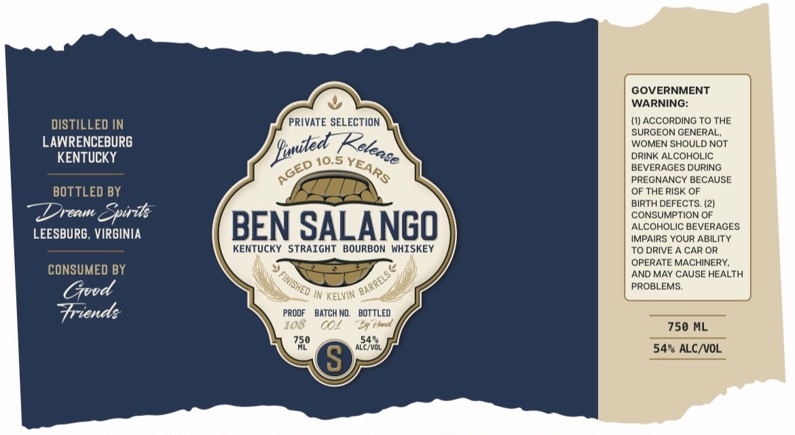

# TTB COLA Label Images - TTBID 26159001000486

**Brand Name:** DREAM SPIRITS

**Fanciful Name:** BEN SALANGO BOURBON

**Issue Date:** 06/11/2026

**Origin Code:** 05

**Product Class/Type:** 101

**Source:** [TTB Public COLA Registry](https://ttbonline.gov/colasonline/viewColaDetails.do?action=publicFormDisplay&ttbid=26159001000486)

## Label Images

### Label 1

## Extracted Label Text

*Text extracted via OCR - may contain errors*

**Detected Proof:** 108

### Label 1

GOVERNMENT
WARNING:
DISTILLED IN
PRIVATE SELECTION
(1) ACCORDING TO THE
SURGEON GENERAL
LAWRENCEBURG
WOMEN SHOULD NOT
KENTUCKY
10.5
DRINK ALCOHOLIC
BEVERAGES DURING
PREGNANCY BECAUSE
BOTTLED BY
OF THE RISK OF
BIRTH DEFECTS: (21
Dream
Epiits
CONSUMPTION OF
LEESBURG, VIRGINIA
BEN SALANGO
ALCOHOLIC BEVERAGES
IMPAIRS YOUR ABILITY
KENTUCKY STRAIGHT
BOURBON WHISKEY
TO DRIVE
CAR OR
OPERATE MACHINERY;
CONSUMED BY
AND MAY CAUSE HEALTH
Gvvd
In KELVIN
PROBLEMS
Triend:
PROOF
BATCH NO;
BOTTLEO
108
COI
Krd
750 ML
750
54%
ALC/VOL
54% ALC /VOL
S
Siited
Ketease
YEARS
GED
) FINISHED =
~BARRELS €
