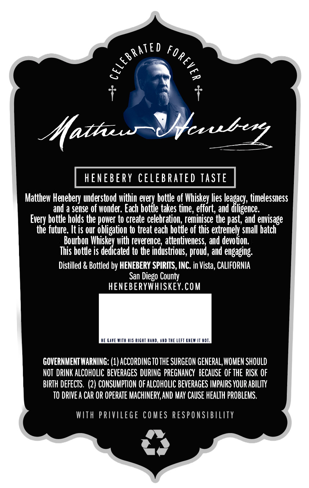
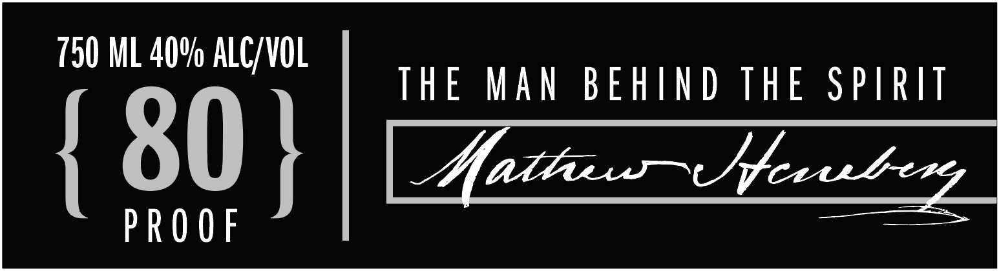

# TTB COLA Label Images - TTBID 26159001000641

**Brand Name:** HENEBERY

**Fanciful Name:** SMALL BATCH BOURBON

**Issue Date:** 06/17/2026

**Origin Code:** 01

**Product Class/Type:** 141

**Source:** [TTB Public COLA Registry](https://ttbonline.gov/colasonline/viewColaDetails.do?action=publicFormDisplay&ttbid=26159001000641)

## Label Images

### Back Label

### Front Label

## Extracted Label Text

*Text extracted via OCR - may contain errors*

### Back Label

Aaths
VJaube
HENEBERY CELEBRATED TASTE
Matthew Henebery understood within every bottle of Whiskey lies leagacy, timelessness
and a Sense of wonder. Each bottle takes
effort, and diligence:
bottle holds the power to create celebration, reminisce the past, and envisage
the future: It is our obligation to treat each botue of this extremely Small batch
Bourbon Whiskey with reverence , attentiveness, and devoton:
This botde is dedicated to de industrious, proud , and engaging:
Distilled & Bottled by HENEBERY SPIRTTS, INC. in Vista, CALIFORNIA
San Diego County
HENEBERYWHISKEY.COM
HE GAYE WITH HIS RIGHT HaAD, AnD THE LEFT KHEW
HOT:
GOVERNMENTWARNING: (1) ACCORDING TO THE SURGEON GENERAL, WOMEN SHOULD
NOT  DRINK ALCOHOLIC BEVERAGES DURING  PREGNANCY   bECaUSe  OF THE  RISK OF
BIRTH DefECTS . (2) CONSUMPTION OF ALCOHOLIC BEVERAGES IMPAIRS YOUR ABILITY
TO DRIVE A CAR OR OPERATE MACHINERY,AND MAV CAUSE HEALTH pROBLEMS.
WIth PRIVILEge COMES RESPONSIBILITY
RATEd
1
1
time ,
Every '

### Front Label

0
eee ie THE MAN BEHIND THE SPIRIT
PROOF
