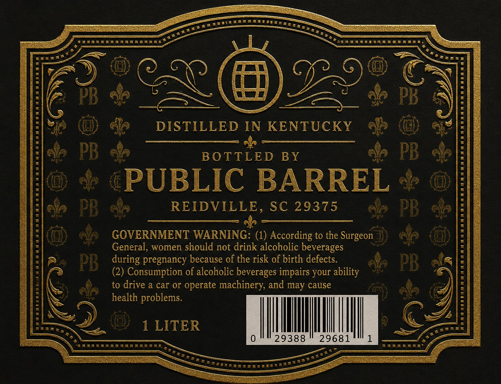
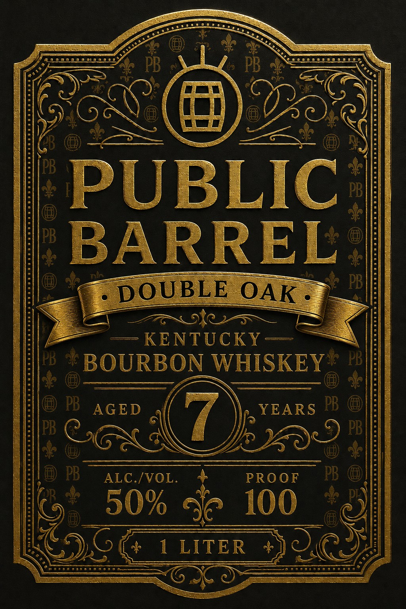

# TTB COLA Label Images - TTBID 26159001000647

**Brand Name:** PUBLIC BARREL

**Issue Date:** 06/12/2026

**Origin Code:** 41

**Product Class/Type:** 141

**Source:** [TTB Public COLA Registry](https://ttbonline.gov/colasonline/viewColaDetails.do?action=publicFormDisplay&ttbid=26159001000647)

## Label Images

### Back Label

### Front Label

## Extracted Label Text

*Text extracted via OCR - may contain errors*

### Back Label

=

PTL LLL

I een

wanaae

S Pi

Seeman

@

») :

c

A)

A

Zs

(J

NG

s\

Cee we

bid

és

cae

padi

Saf

DISTILLED IN KENTUCKY ®&2

Ne

Ue

i

BOTTLED BY

&5

PUBLIC BARREL

=

REIDVILLE, SC 29375

==

-

GOVERNMENT WARNING: (1) According to the Surgeon

General, women should not drink alcoholic beverages

during pregnancy because of the risk of birth defects,

a

(2) Consumption of alcoholic beverages impairs your ability

to drive a car or operate machinery, and may cause

health problems

=

¢

TRER a,

»

1 LITER

Il

|

|

|

MI

mR

29388

29681

a

RRHARAAA ATA,

aS

RR RaRARR

Be

sate

aaaaR

ane®

### Front Label

SS

iS ree

severe

SS

~ ©

Soascaosanae

Seererererrrs os 1)

y\I=

PB ee

aS

yr

AS) fs

PUL

BLIC:

‘BARREL

. DOUBLE OAK -

Ca =\ ae)

— KENTUCKY —

eR EON gh eG

AGED

YEARS

CEM fod!

ALC./VOL.

PROOF

a

i

50% <p 100

4

Wee OG

\fxacss stress sees

SEE /

TER JOC

=

DSC)
