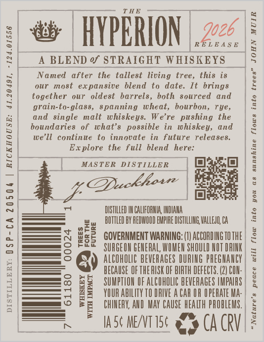
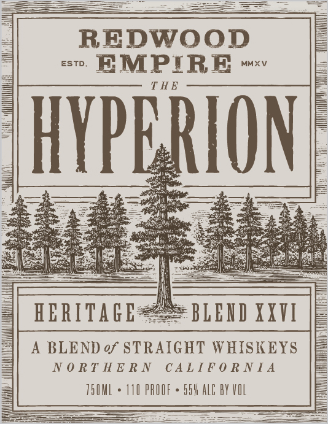
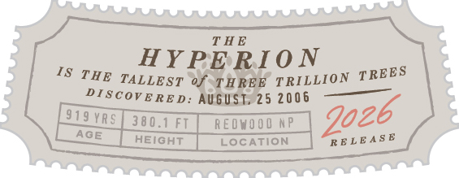

# TTB COLA Label Images - TTBID 26159001000856

**Brand Name:** REDWOOD EMPIRE

**Fanciful Name:** THE HYPERION

**Issue Date:** 06/12/2026

**Origin Code:** 01

**Product Class/Type:** 120

**Source:** [TTB Public COLA Registry](https://ttbonline.gov/colasonline/viewColaDetails.do?action=publicFormDisplay&ttbid=26159001000856)

## Label Images

### Back Label

### Label 1

### Label 3

## Extracted Label Text

*Text extracted via OCR - may contain errors*

**Detected Proof:** 110

### Back Label

-124.01556

DISTILLERY: D§P-CA 20504 | RICKHOUSE: 41.20491,

joe

R alae

at | HYPERION

__A BLEND % STRAIGHT WHISKEYS

"Named after the tallest living tree, this is
our most expansive blend to date. It brings
together our oldest barrels, both sourced and
grain-to-glass, spanning wheat, bourbon, rye,
and single malt whiskeys. We're pushing the
boundaries of what’s possible in whiskey, and
we'll continue to innovate in future releases.
Explore the full blend here:

“MASTER DISTILLER & (O}

E D2

DISTILLED IN CALIFORNIA, INDIANA
BOTTLED BY REDWOOD EMPIRE DISTILLING VALLEJO, CA

GOVERNMENT WARNING: (1) ACCORDING TO THE
SURGEON GENERAL WOMEN SHOULD NOT DRINK

=
oF
ie
Bo
4

g BECAUSE OF THERISK OF BIRTH DEFECTS. (2) CON-
5 i SUMPTION OF ALCOHDLIC BEVERAGES IMPAIRS
rE

e FUTURE

YOUR ABILITY TO DRIVE AGAR OR OPERATE MA-
CHIMERY, AND MAY aT) HEALTH PROBLEMS. |

ALCOHOLIC BEVERAGES DURING PREGNANCY | %

IASC MEATISE af» CA CRV|

“Nature’s peace will flow into you as sunshine flows into trees” JOHN MUIR

### Label 1

REDWOOD

eo EMPIRE

THE

HY?

ION

ages

HERITAGE

BLEND XXVI

A BLEND of STRAIGHT WHISKEYS

NORTHERN CALIFORNIA

TSOML +

110 PROOF

5h ALC AY VOL

=

### Label 3

THE
ts AY Pi ON
THE TALLEST af THREE TRILLION TREES
PIScovERED: 5 2006 2b
LS ELON REOWOOO AP goz
[ Hetent | cocation | “reveas®
