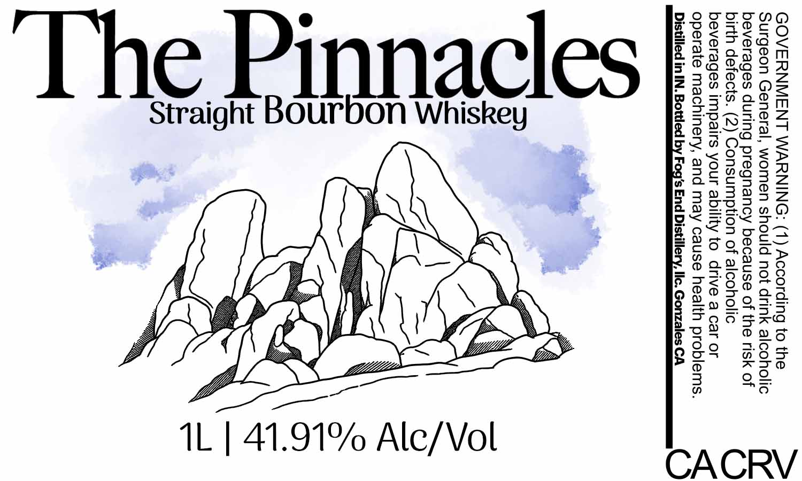

# TTB COLA Label Images - TTBID 26159001000896

**Brand Name:** THE PINNACLES

**Issue Date:** 06/22/2026

**Origin Code:** 01

**Product Class/Type:** 101

**Source:** [TTB Public COLA Registry](https://ttbonline.gov/colasonline/viewColaDetails.do?action=publicFormDisplay&ttbid=26159001000896)

## Label Images

### Label 1

## Extracted Label Text

*Text extracted via OCR - may contain errors*

**Detected Proof:** 83.8

### Label 1

GOVERNMENT WARNING: (1) According to the
Surgeon General, women should not drink alcoholic
beverages during pregnancy because of the risk of
birth defects. (2) Consumption of alcoholic
beverages impairs your ability to drive a car or
operate machinery, and may cause health problems.
Distilled in IN. Bottled by Fog's End Distillery, Ilc. Gonzales CA

bon Wh

nnacles

@
al

Straight

‘The

CACRV

1L | 41.91% Alc/Vol
