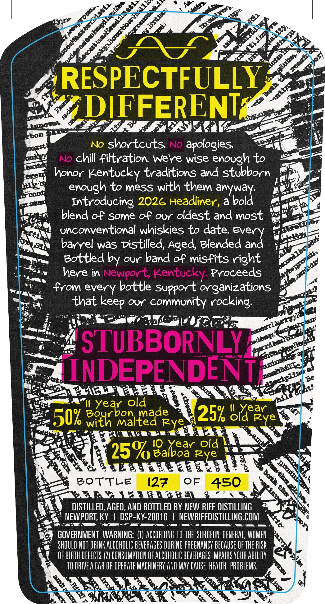
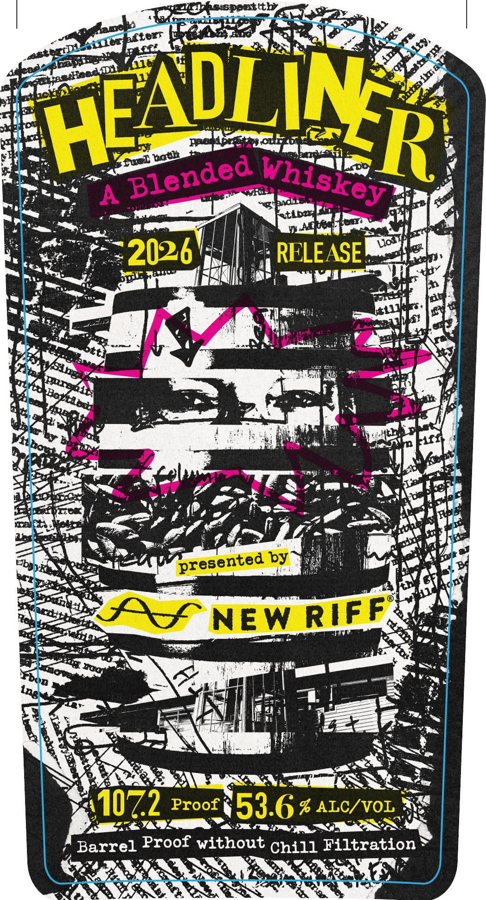
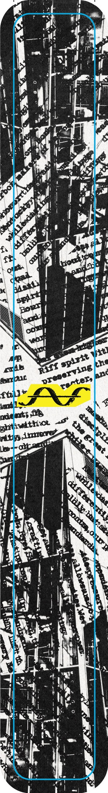

# TTB COLA Label Images - TTBID 26160001000279

**Brand Name:** HEADLINER

**Issue Date:** 06/18/2026

**Origin Code:** 22

**Product Class/Type:** 137

**Source:** [TTB Public COLA Registry](https://ttbonline.gov/colasonline/viewColaDetails.do?action=publicFormDisplay&ttbid=26160001000279)

## Label Images

### Back Label

### Front Label

### Label 3

## Extracted Label Text

*Text extracted via OCR - may contain errors*

*2 image(s) excluded: text did not meet readability threshold*

### Back Label

RESPECTFULLY
8
DIFFERENT
Ibon
No
shor tcuts
No
apologies:
No chill filtration Weye wise
enough to
honor
Kentucky traditions and stubborn
enough to mesS with them anyway:
Introducing 2026 Headliner , abold
blend of Some of our oldest and most
unconventional whiskies to date Every
barrel was Distilled Aged, Blended and
Bottled by our band of misfits right
here in
Newport Kentucky Proceeds
from every bottle Suppor t organizations
that
OUr
community rocking
STUBBORNLY
INDEPENDENT
B
II Year old
50k eiti boaiteade
25%
Il
Slaeaye
Rye
I0
old
25% Balboar Rold
a Uedh #e E 2
Bottle
127
OF
450
PLRERR & #E
DISTILLED, AGED, AND BOTTLED BY NEW RIFF DISTILLING
NEWPORT, KY
DSP-KY-20016
NEWRIFFDISTILLING.COM
GOVERNMENT  WARNING:
ACCORDIUG TO The  SURGEON GENERAL, WOMEV
SHOULD HOT DRLHK ALCOHOLIC BEVERAGES DURILG PREGHANCY BECAUSE OF THE RISK
OF BIRTH DEFECTS: (2} COHSUMPTIOU OF ALCOHOLIC BEVERAGES IMPAIRS VOUR AbILITy
TI RIVEA CAR OR OPERATE MACHINERY,AlD MAY CAUSE  HEalth  PROBLEMS
a1
AZLA
41
NeD
~Ne
pisu
1
1
1
esherin
eretI
keep
bm
