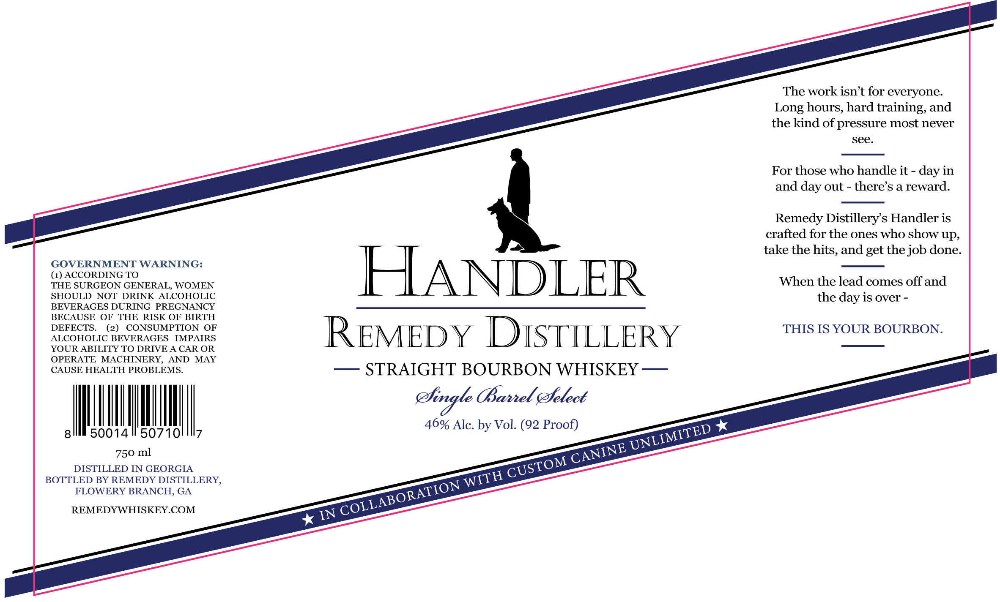

# TTB COLA Label Images - TTBID 26160001000345

**Brand Name:** HANDLER

**Issue Date:** 06/17/2026

**Origin Code:** 08

**Product Class/Type:** 101

**Source:** [TTB Public COLA Registry](https://ttbonline.gov/colasonline/viewColaDetails.do?action=publicFormDisplay&ttbid=26160001000345)

## Label Images

### Label 1

## Extracted Label Text

*Text extracted via OCR - may contain errors*

**Detected Proof:** 92

### Label 1

The work isnt for everyone
Long hours, hard training, and
the kind of pressure most never
see.
For those who handle it - day in
and
out
there s a reward.
Remedy Distillery s Handler is
crafted for the ones who show up,
take the hits, and get the job done:
GOVERNMENT WARNING:
{HASCRGDOG GONERAL,
WOMEN
HANDLER
When the lead comes off and
SHOULD
NOT
DRINK
ALCOHOLIC
the
is over
BEVERAGES DURING
PREGNANCY
BECAUSE
OF
THE
RISK OF BIRTH
DEFECTS.
(2)
CONSUMPTION
OF
REMEDY DISTILLERY
THIS IS YOUR BOURBON.
ALCOHOLIC BEVERAGES
IMPAIRS
YOUR ABILITY TO DRIVE A CAR OR
OPERATE
MACHINERY,
AND
MAY
CAUSE HEALTH PROBLEMS
STRAIGHT BOURBON WHISKEY
efingle BBavel efelect
46% Alc. by Vol. (92 Proof)
8
50014
50710
750
DISTILLED IN GEORGIA
BOTTLED BY REMEDY DISTILLERY,
FLOWERY BRANCH, GA
REMEDYWHISKEY COM
IN
day :
day -
UNLIMITED
CANINE
ml
CUSTOM
WITH
COLLABORATION
