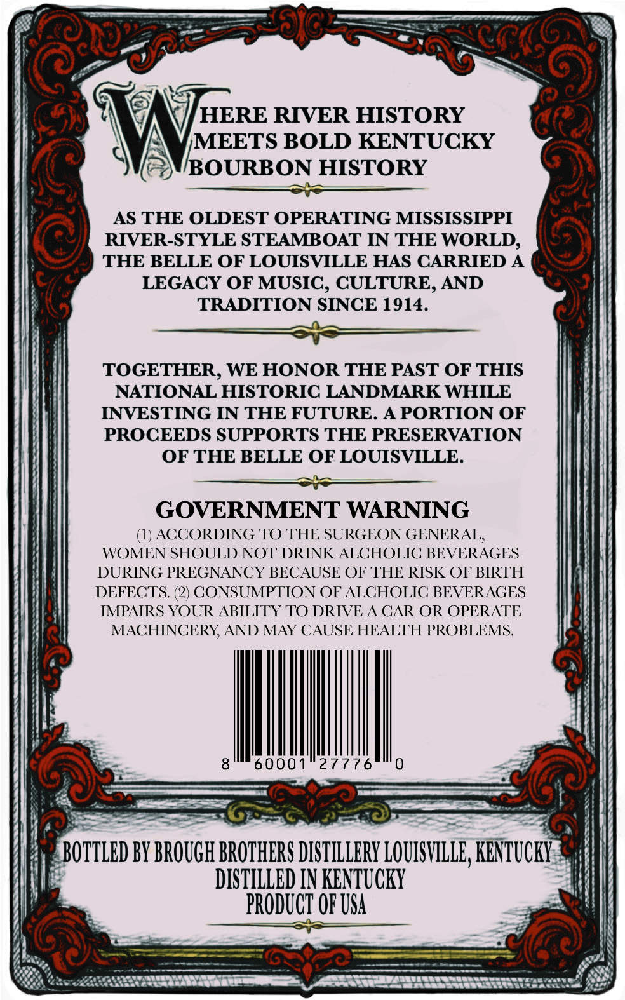
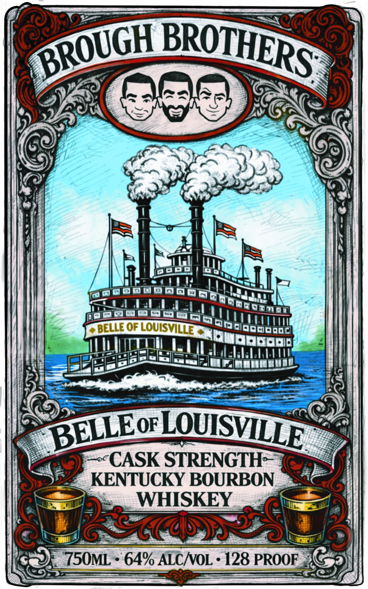

# TTB COLA Label Images - TTBID 26160001000414

**Brand Name:** BROUGH BROTHERS

**Fanciful Name:** BELLE OF LOUISVILLE CASK STRENGTH

**Issue Date:** 06/15/2026

**Origin Code:** 22

**Product Class/Type:** 141

**Source:** [TTB Public COLA Registry](https://ttbonline.gov/colasonline/viewColaDetails.do?action=publicFormDisplay&ttbid=26160001000414)

## Label Images

### Back Label

### Front Label

## Extracted Label Text

*Text extracted via OCR - may contain errors*

**Detected Proof:** 128

### Back Label

7C
HERE RIVER HISTORY
MEETS BOLD KENTUCKY
BOURBON HISTORY
AS THE OLDEST OPERATING MISSISSIPPI
RIVER-STYLE STEAMBOAT IN THE WORLD,
THE BELLE OF LOUISVILLE HAS CARRIED A
LEGACY OF MUSIC , CULTURE, AND
TRADITION SINCE 1914.
TOGETHER, WE HONOR THE PAST OF THIS
NATIONAL HISTORIC LANDMARK WHILE
INVESTING IN THE FUTURE. A PORTION OF
PROCEEDS SUPPORTS THE PRESERVATION
OF THE BELLE OF LOUISVILLE.
GOVERNMENT WARNING
ACCORDING TO THE SURGEON GENERAL;
WOMEN SHOULD NOT DRINK ALCHOLIC BEVERAGES
DURING PREGNANCY BECAUSE OF THE RISK OF BIRTH
DEFECTS. (2) CONSUMPTION OF ALCHOLIC BEVERAGES
IMPAIRS YOUR ABILITY TO DRIVE A CAR OR OPERATE
MACHINCERY AND MAY CAUSE HEALTH PROBLEMS
60001
27776
BOTTLED BY BROUGH BROZHERS DISTILLERY LOUISVILLE; KENTUCKY
DISTILLED IN KENTUCKY
PRODUCT OF USA

### Front Label

BEQNEOFOUSV
CASK STRENGTH
KENTUCKY BOURBON
WHISKEY
Cos
750ML
64% ALCNOL
128 PROOF
BROTHERS
BROUGH
LOUISVLLE
BELLEoF
