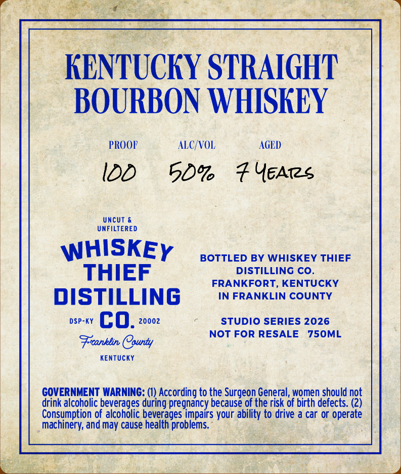
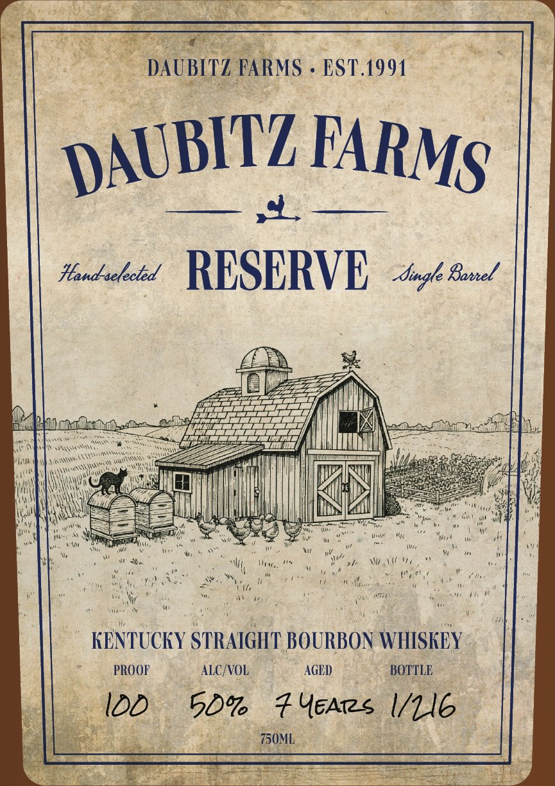

# TTB COLA Label Images - TTBID 26160001000539

**Brand Name:** WHISKEY THIEF DISTILLING CO.

**Fanciful Name:** DAUBITZ FARMS 100 PF

**Issue Date:** 06/15/2026

**Origin Code:** 22

**Product Class/Type:** 101

**Source:** [TTB Public COLA Registry](https://ttbonline.gov/colasonline/viewColaDetails.do?action=publicFormDisplay&ttbid=26160001000539)

## Label Images

### Back Label

### Front Label

## Extracted Label Text

*Text extracted via OCR - may contain errors*

**Detected Proof:** 100

### Back Label

KENTUCKY STRAIGHT
BOURBON WHISKEY
PROOF
ALC/VOL
AGED
Uncut &
UNFILTERED
WHISKEY
BOTTLED BY WHISKEY THIEF
THIEF
DISTILLING CO_
FRANKFORT, KENTUCKY
DISTILLING
IN FRANKLIN COUNTY
DSP-KY
co.
20002
STUDIO SERIES 2026
NOT FOR RESALE
750ML
Frronktin County
Kentucky
GQVERNMENT WARNING: (1) According to the Surgeon General, women should not
drink alcoholic beverages
pregnancy because of the risk of birth defects. (2)
Consumption of alcoholic beverages impairs your ability to drive a car or operate
machinery; and may cause health problems.
during

### Front Label

DAUBITZ FARMS
EST.991
HEand selected
RESERVE
ingle Bonel
KENTUCKY STRAIGHT BOURBON WHISKEY
PROOF
ALC/VOL
AGED
BOTTLE
IDD
50%
# YEArs 1/1l6
750ML
DAUBITZ
FARMS
