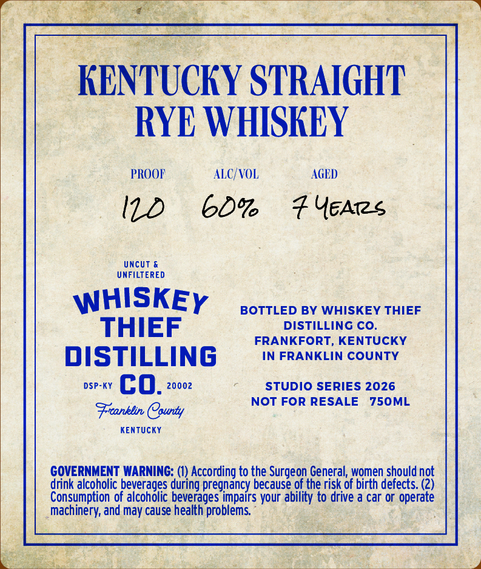
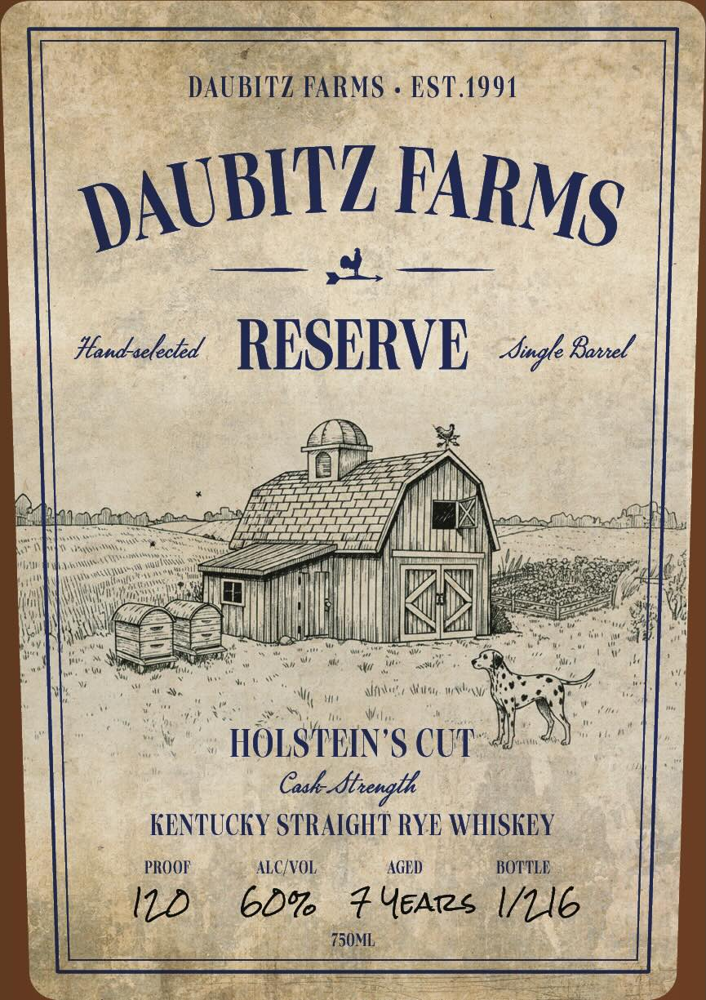

# TTB COLA Label Images - TTBID 26160001000555

**Brand Name:** WHISKEY THIEF DISTILLING CO.

**Issue Date:** 06/19/2026

**Origin Code:** 22

**Product Class/Type:** 102

**Source:** [TTB Public COLA Registry](https://ttbonline.gov/colasonline/viewColaDetails.do?action=publicFormDisplay&ttbid=26160001000555)

## Label Images

### Back Label

### Front Label

## Extracted Label Text

*Text extracted via OCR - may contain errors*

**Detected Proof:** 120

### Back Label

KENTUCKY STRAIGHT
RYE WHISKEY
PROOF
ALC/VOL
AGED
Uncut &
UNFILTERED
WHISKEY
BOTTLED BY WHISKEY THIEF
THIEF
DISTILLING CO.
FRANKFORT, KENTUCKY
DISTILLING
IN FRANKLIN COUNTY
DSP-KY
co_
20002
STUDIO SERIES 2026
NOT FOR RESALE
750ML
Frranblin County
KenTUcKY
GOVERNMENT WARNING: (1) According to the Surgeon General; women should not
drink alcoholic beverages during pregnancy because of the risk of birth defects. (Z)
Consumption of alcoholic beverages impairs your ability to drive a car or operate
machinery; and may cause health problems

### Front Label

DAUBITZ FARMS
EST.1991
Hand selected
RESERVE
Sigle Bonrel
WW
HOLSTEIN 'S CUT
Cask-ftength
KENTUCKY STRAIGHT RYE WHISKEY
PROOF
ALC/VOL
AGED
BOTTLE
ID
60%
# YEArs 1/1l6
750ML
DAUBITZ
FARMS
