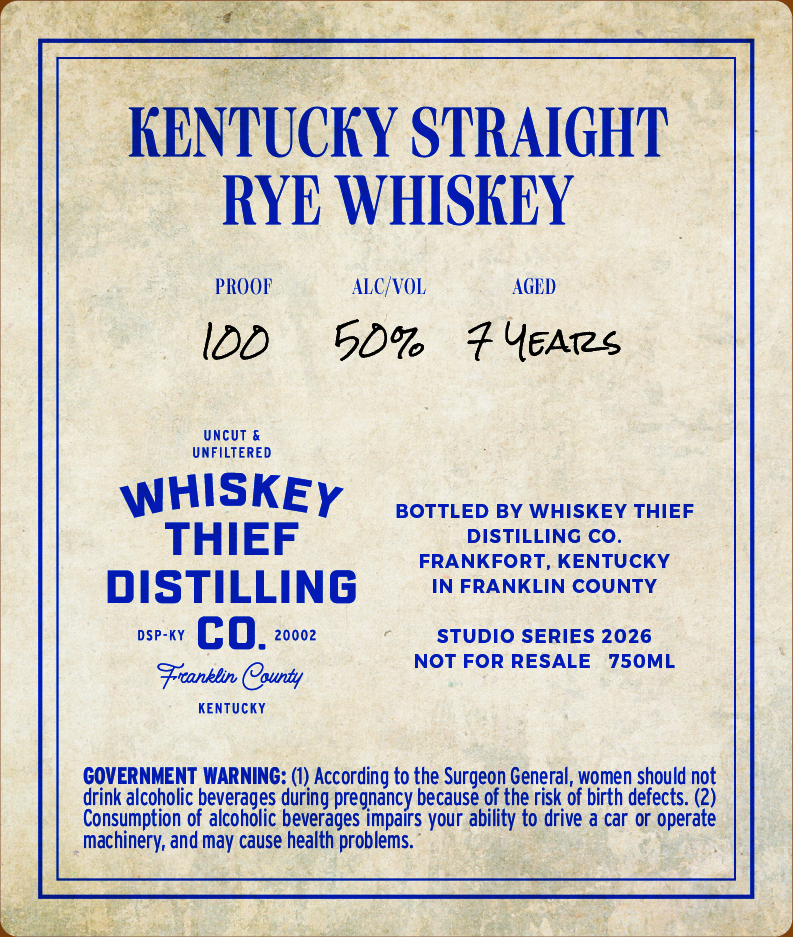
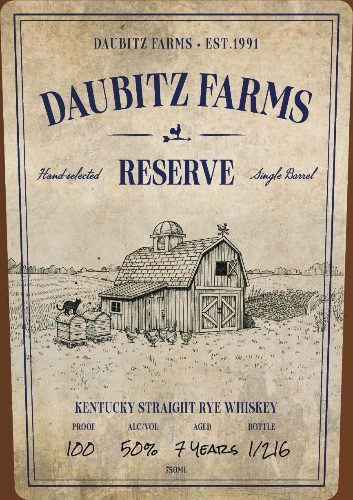

# TTB COLA Label Images - TTBID 26160001000558

**Brand Name:** WHISKEY THIEF DISTILLING CO.

**Fanciful Name:** DAUBITZ FARMS RESERVE - 100 PF RYE

**Issue Date:** 06/15/2026

**Origin Code:** 22

**Product Class/Type:** 102

**Source:** [TTB Public COLA Registry](https://ttbonline.gov/colasonline/viewColaDetails.do?action=publicFormDisplay&ttbid=26160001000558)

## Label Images

### Back Label

### Front Label

## Extracted Label Text

*Text extracted via OCR - may contain errors*

### Back Label

KENTUCKY STRAIGHT
RYE WHISKEY
PROOF
ALC/VOL
AGED
Uncut &
UNFILTERED
WHISKEY
BOTTLED BY WHISKEY THIEF
THIEF
DISTILLING CO_
FRANKFORT, KENTUCKY
DISTILLING
IN FRANKLIN COUNTY
DSP-KY
co_
20002
STUDIO SERIES 2026
NOT FOR RESALE
750ML
Fronblin County
Kentucky
COVERNMENT WARNING: (1) According to the Surgeon General, women should not
drink alcoholic beverages during pregnancy because of the risk of birth defects: (2)
Consumption of alcoholic beverages impairs your ability to drive a car or operate
machinery; and may cause health problems.

### Front Label

Re eas OY Marty
—_ DAUBITZ FARMS « BST.1991
Heandacheed RESERVE, 44 Gone!
A
. gles
See ee I Se ,
te ee willl RNs weer.
aie eel MG eaccaei
ek ko, °c |
DM ort ta ee tc igo Tete wane P|
KENTUCKY STRAIGHT RYE WHISKEY —
it PROOF ALC/VOL AGED BOTTLE
ls. 100 5D% F Yeates VLG
| ae pe gate as 3
