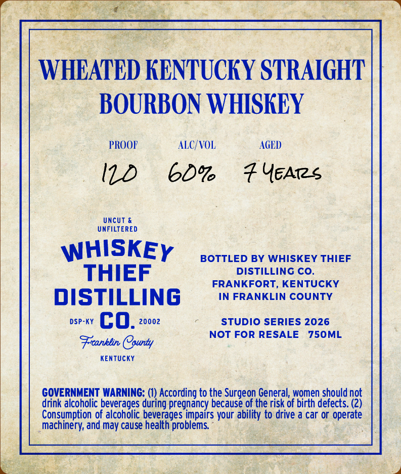
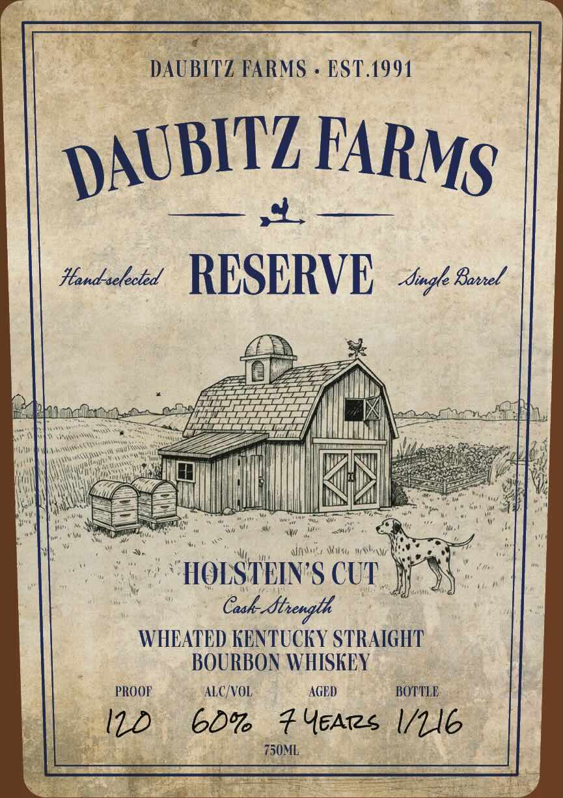

# TTB COLA Label Images - TTBID 26160001000563

**Brand Name:** WHISKEY THIEF DISTILLING CO

**Fanciful Name:** DAUBITZ FARMS RESERVE - CASK STRENGTH WHEATED

**Issue Date:** 06/15/2026

**Origin Code:** 22

**Product Class/Type:** 101

**Source:** [TTB Public COLA Registry](https://ttbonline.gov/colasonline/viewColaDetails.do?action=publicFormDisplay&ttbid=26160001000563)

## Label Images

### Back Label

### Front Label

## Extracted Label Text

*Text extracted via OCR - may contain errors*

### Back Label

WHEATED KENTUCKY STRAIGHT
BOURBON WHISKEY
PROOF
ALC/VOL
AGED
Uncut &
UNFILTERED
WHISKEY
BOTTLED BY WHISKEY THIEF
THIEF
DISTILLING CO.
FRANKFORT, KENTUCKY
DISTILLING
IN FRANKLIN COUNTY
DSP-KY
cO_
20002
STUDIO SERIES 2026
NOT FOR RESALE
750ML
Frranblin Caunty
KEnTUcKY
GOVERNMENT WARNING: (1) According to the Surgeon General; women should not
drink alcoholic beverages during pregnancy because of the risk of birth defects: (2)
Consumption of alcoholic beverages impairs your ability to drive a car or operate
machinery; and may cause health problems

### Front Label

(ENR Sab 6 a ES so
bs ~ DAUBITZ FARMS - EST.1991 ,
Handedeed RESERVE, 46 G02

iy ¥
Pinch ocophpe TL TLL Tf ANN a maa nena FM,
ea Cee an area il iil areee ; 4
Be a aR ere
PANE ail ©) set
HWA NNN 97a pease" Ky
ay cess 0 NM INA eager be
P ia er os meek Wien Whee Waite wrt i og ef :
|. 9 SHOLSTEIN'S CUT. e “{ Me

WHEATED KENTUCKY STRAIGHT
: BOURBON WHISKEY
PROOF ALC/VOL. AGED BOTTLE
j| 120 60% Fears I/LI6
2) Ty ade es aa
