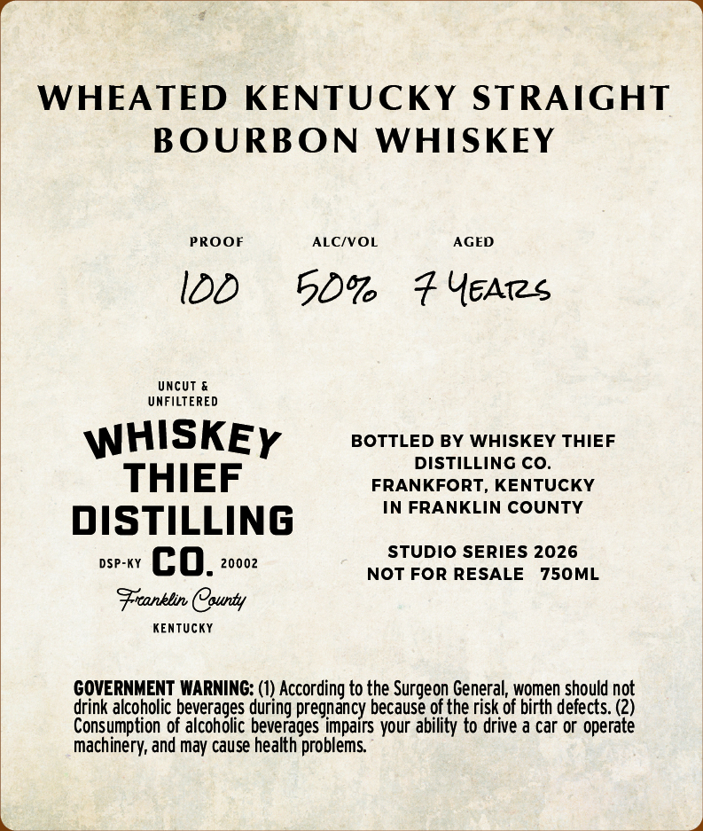
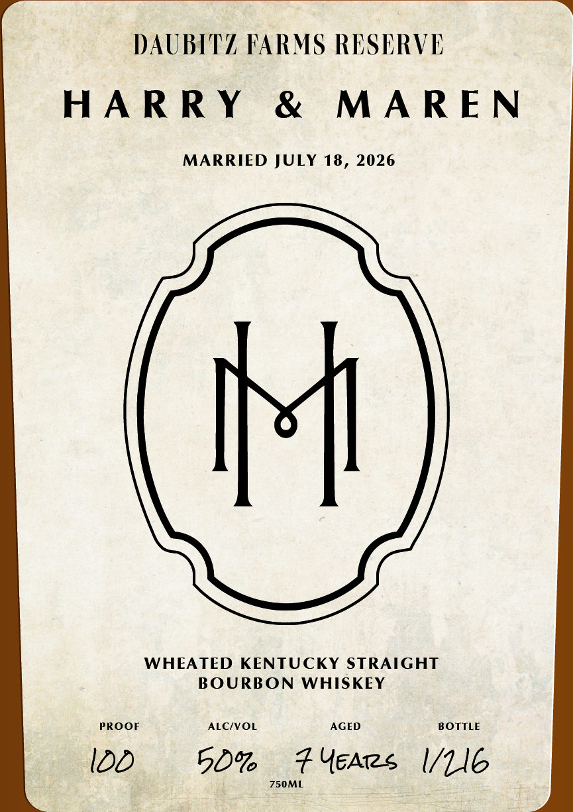

# TTB COLA Label Images - TTBID 26160001000566

**Brand Name:** WHISKEY THIEF DISTILLING CO

**Fanciful Name:** DAUBITZ FARMS RESERVE - HARRY AND MAREN WHEATED

**Issue Date:** 06/15/2026

**Origin Code:** 22

**Product Class/Type:** 101

**Source:** [TTB Public COLA Registry](https://ttbonline.gov/colasonline/viewColaDetails.do?action=publicFormDisplay&ttbid=26160001000566)

## Label Images

### Back Label

### Front Label

## Extracted Label Text

*Text extracted via OCR - may contain errors*

### Back Label

WHEATED KENTUCKY STRAIGHT
BOURBON WHISKEY
PROOF ALC/VOL AGED
ILD 50% Fears
UNCUT &
UNFILTERED
WHISKEy BOTTLED BY WHISKEY THIEF
DISTILLING CO.
THIEF FRANKFORT, KENTUCKY
DISTILLING IN FRANKLIN COUNTY
STUDIO SERIES 2026
oseay EQ, 20002 NOT FOR RESALE 750ML
Freanklin (purty
KENTUCKY.
GOVERNMENT WARNING; (1) According to the Surgeon General, women should not
drink alcoholic beverages during pregnancy because of the risk of birth defects. (2)
Consumption of alcoholic beverages impairs your ability to drive a car or operate
Machinery, and may cause health problems,
ay

### Front Label

DAUBITZ FARMS RESERVE
HARRY & MAREN

MARRIED JULY 18, 2026

WHEATED KENTUCKY STRAIGHT
BOURBON WHISKEY

PROOF ALC/VOL AGED BOTTLE

0D 50% Ferree /LG
