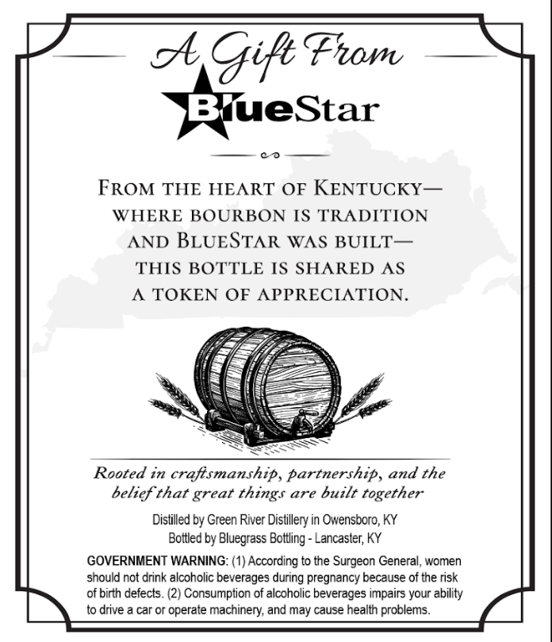

# TTB COLA Label Images - TTBID 26160001000572

**Brand Name:** BLUESTAR

**Issue Date:** 06/15/2026

**Origin Code:** 22

**Product Class/Type:** 101

**Source:** [TTB Public COLA Registry](https://ttbonline.gov/colasonline/viewColaDetails.do?action=publicFormDisplay&ttbid=26160001000572)

## Label Images

### Back Label

## Extracted Label Text

*Text extracted via OCR - may contain errors*

### Back Label

Gife From
BueStar
FROM THE HEART OF KENTUCKY-
WHERE BOURBON IS TRADITION
AND BLUESTAR
WAS BUILT
THIS BOTTLE IS SHARED AS
TOKEN OF APPRECIATION_
Rooted in craftsmanship, partnership, and the
belief that great
are
built together
Distilled by Green River Distillery in Owensboro, KY
Bottled by Bluegrass
Lancaster; KY
GOVERNMENT WARNING: (1) According to the Surgeon General, women
should not drink alcoholic beverages during pregnancy because of the risk
of birth defects_
Consumption of alcoholc beverages impairs your ability
to drive a car or operate machinery; and may cause health problems_
things
Bottling -
