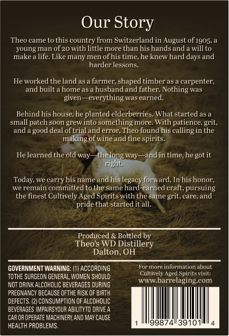
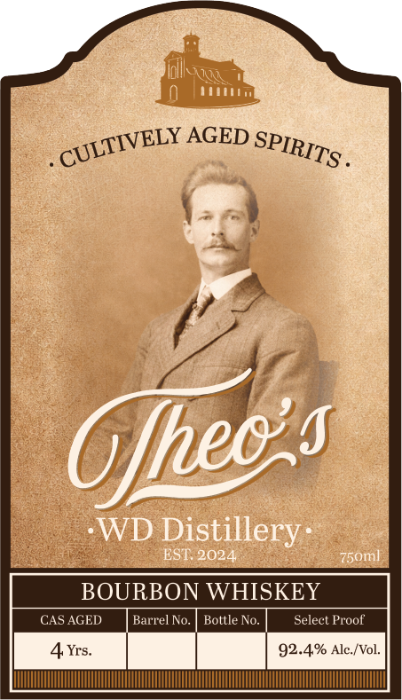

# TTB COLA Label Images - TTBID 26160001000595

**Brand Name:** THEO'S WD DISTILLERY B0URBON WHISKEY

**Issue Date:** 06/25/2026

**Origin Code:** 09

**Product Class/Type:** 141

**Source:** [TTB Public COLA Registry](https://ttbonline.gov/colasonline/viewColaDetails.do?action=publicFormDisplay&ttbid=26160001000595)

## Label Images

### Back Label

### Front Label

### Label 3

## Extracted Label Text

*Text extracted via OCR - may contain errors*

*1 image(s) excluded: text did not meet readability threshold*

### Back Label

Our Story
Theo came to this country from Swilzerland in August o[' 1905,
young man ol 20 with little more than his hands and
willto
make
life: Like many men of his time,he knew hard days and
harder lessons:
He worked the land a;
farmer; shaped timber a5
carpenter;
and built
home a5
husband
father: Nothing was
given
everything was earned.
Behind his house, he planted elderberries
Whal slarled a5a
small patch soon grew into something more: With patience, grit,
and
good deal oftrial and error; Theo foundhis calling in the
making of wine and fine spirits.
He learned the old way
the long way
andin time, he got it
right.
Today; we carry his name and his legacy forward. In his honor;
we remain committed to the same hard-earned craft, pursuing
the finest Cullively Aged Spirits with the same
careand
pride that started it all.
Produced & Bottled by
Theos WD Distillery
Dalton, OH
GOVERNMENT WARNING: (I| ACCORDING
For more information about
Cultively Aged Spirits visit:
toTHE SURGEON GENERAL, WOMEN shquld
Anteeen
barrelaging com
NOT DRINK ALCOHOLIC BEVEFAGES DURING
PREGNANCY BECAUSE QFTHE RISK OF BIRTH
DEFECTS: (2/ CONSUMPTION OF AlcohOLIC
BEVERAGES IMPAIRSYOUR ABILITYTO DRWVE
CAR OR OPERATE MACHINERY AND MAY CAUSE
998
3910
HEALTH PROBLEMS:
and
'gril,

### Front Label

fle
pan
psTIVBLY AGED Sep
=
WP
- ge YI
oo LOT
BOURBON WHISKEY
CAS AGED Barrel No. | Bottle No. Select Proof
Co
