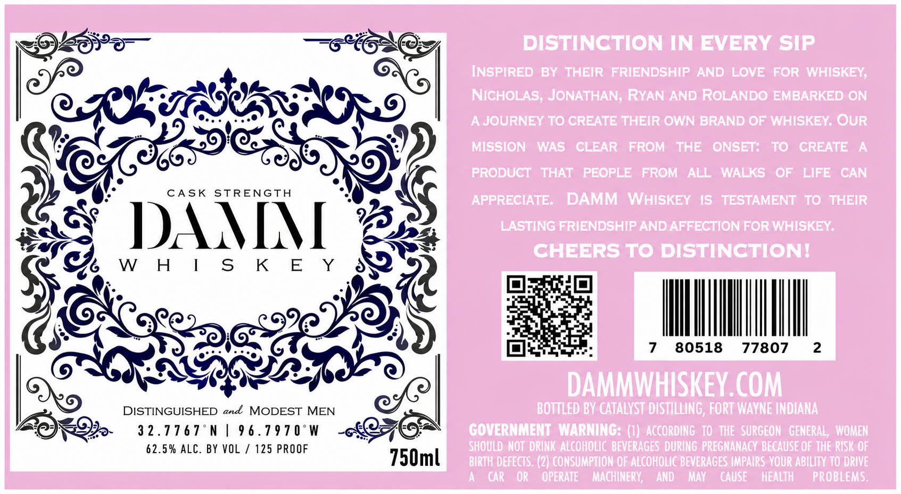

# TTB COLA Label Images - TTBID 26160001000729

**Brand Name:** DAMM WHISKEY

**Issue Date:** 06/15/2026

**Origin Code:** 19

**Product Class/Type:** 140

**Source:** [TTB Public COLA Registry](https://ttbonline.gov/colasonline/viewColaDetails.do?action=publicFormDisplay&ttbid=26160001000729)

## Label Images

### Label 1

## Extracted Label Text

*Text extracted via OCR - may contain errors*

**Detected Proof:** 125

### Label 1

DISTINCTION IN EVERY sip
Inspired By thbir FRIeNdsHIP AND LOVE FOR WHISKEY;
NIcHoLAS, JoNATHAN, RYAN AND ROLANDO EMBARKED @N
AJJOURNEY T0 CREATE THEIR OWN BRAND @F WHISKEY OUR
MISSION
WAS
CLEAR
FROM
THE
ONSETS
T0
CREATE
A
PRODUUCT   THAT
PEOPLE
FROM
ALL  WALKS
OF
LIFE
CAN
CA SK
STRENGTH
APPRECIATE;
DAMM WHISKEY
1S
TESTAMENT  T0: THEIR
DAIMN [
LASTING FRIENDSHIP AND AFFECTION FoR WHISKEY
cHEERS T0 DISTINCTIONI
WH [ s K E
Y
7
80518
77807
2
DAMMWHISKEY COM
DISTINGUISHED and MODEST MEN
BOTTLED BY CATALYST DISTILLING, FORT WAYNE INDIANA
3 2 . 77 6 7
N
9 6 . 7 9 7 0 "W
GOVERNMENT WARNING: (I) AccoRding  TO   ThE  SURGEON   GENERAL , WOMEN
62.5 % ALC,
BY VOL
125 PROOF
SHOULD  NOT  DRINK ALCOHOLIC  BEVERAGES  DURING  PREGNANACY BECAUSE OF THE RISK OF
750ml
BIRTH DEFECTS. (2) CONSUMPTION OF ALCOHOLIC BEVERAGES IMPAIRS YoUR ABILITY TO DRIVE
CAr
YOR
OPERATE
MAghINERV
AND
MAY
CAUSE
HeaLTH
PROBLEMS
