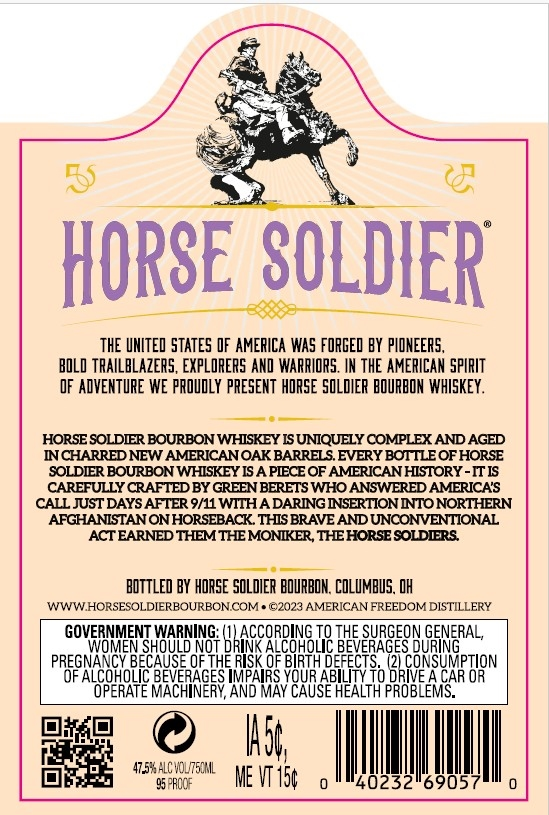
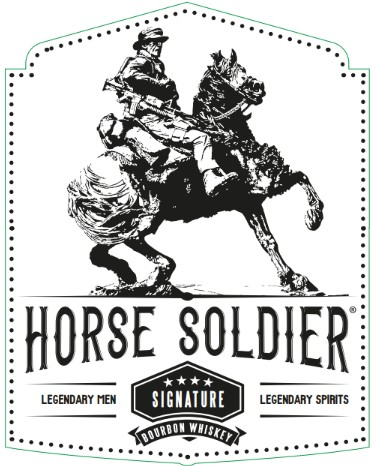
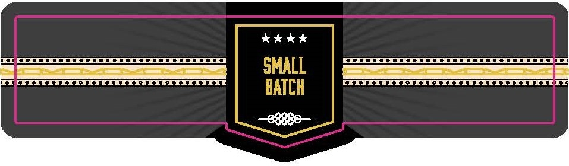

# TTB COLA Label Images - TTBID 26160001000883

**Brand Name:** HORSE SOLIDER

**Issue Date:** 06/22/2026

**Origin Code:** 09

**Product Class/Type:** 101

**Source:** [TTB Public COLA Registry](https://ttbonline.gov/colasonline/viewColaDetails.do?action=publicFormDisplay&ttbid=26160001000883)

## Label Images

### Back Label

### Front Label

### Label 4

## Extracted Label Text

*Text extracted via OCR - may contain errors*

### Back Label

Sea

ye

“aS

BS

@

HORSE SOLD SOLDIER

THE UNITED STATES OF AMERICA WAS FORGED BY PIONEERS,

BOLO TRAILBLAZERS, EXPLORERS AND WARRIORS. IN THE AMERICAN SPIRIT

OF ADVENTURE WE PROUDLY PRESENT HORSE SOLDIER BOURBON WHISKEY.

—e——

HORSE SOLDIER BOURBON WHISKEY IS UNIQUELY COMPLEX AND AGED

INCHARRED NEW AMERICAN OAK BARRELS. EVERY BOTTLE OF HORSE

‘SOLDIER BOURBON WHISKEY IS A PIECE OF AMERICAN HISTORY -IT IS

CALL JUST DAYS AFTER 9/11 WITH A DARING INSERTION INTO NORTHERN

CAREFULLY CRAFTED BY GREEN BERETS WHO ANSWERED AMERICA'S

AFGHANISTAN ON HORSEBACK. THIS BRAVE AND UNCONVENTIONAL

ACT EARNED THEM THE MONIKER, THE HORSE SOLDIERS.

BOTTLED BY HORSE SOLDIER BOURBON. COLUMBUS, OH

WW WHORSESOLDIERBOURBON COM ©2023 AMERICAN FREEDOM DISTILLERY

GOVERNMENT WARNING: a hit

CCORDING TO THE SURGEON GENERAL,

LCOHOLIC aa

Nt

PREGNANCY BEANE OFTHE RISK OF city

ALCOHOLIC BEVERAGES IMPAIRS YC

a TS, Gran LFONSUMPTION

OPERATE MACHINERY, AND MAY CAUSE HEALTH PROBLEM

sil

nN

M5

|

|

96 PROGE

Pe ME VT t

40232

69057

|

### Front Label

HORSE  SOLDIER
4a
LEGENDARY NEM
sighatuRe
LEGENDARY SPIRITS

### Label 4

tok kok
SS ea a IFIAl
S|) eee
CEXEKEREKESEUREEISERSUKESIERERIEE DaATCU (CER UKENKENIEESUUEEEUUEESIULESIE
DAILN
