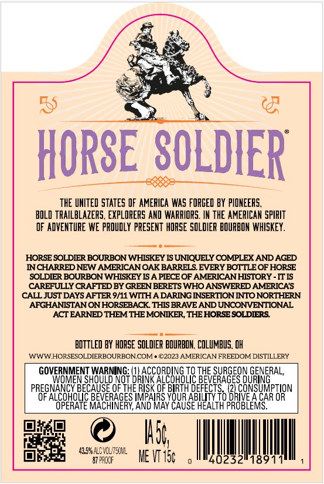
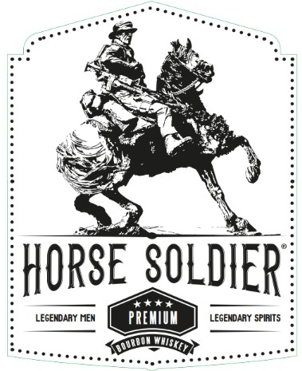
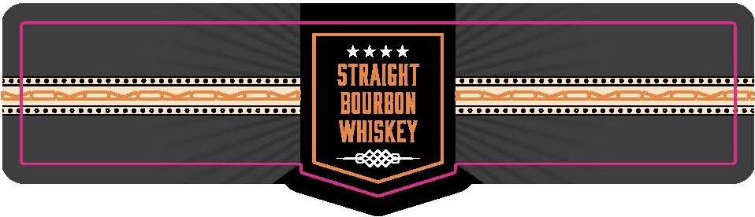

# TTB COLA Label Images - TTBID 26160001000884

**Brand Name:** HORSE SOLDIER

**Issue Date:** 06/22/2026

**Origin Code:** 09

**Product Class/Type:** 101

**Source:** [TTB Public COLA Registry](https://ttbonline.gov/colasonline/viewColaDetails.do?action=publicFormDisplay&ttbid=26160001000884)

## Label Images

### Back Label

### Front Label

### Label 4

## Extracted Label Text

*Text extracted via OCR - may contain errors*

*1 image(s) excluded: text did not meet readability threshold*

### Back Label

a toh
Set Ree
eos
aa
i RRS ie,
Shy 5
THE UNITED STATES OF AMERICA WAS FORGED BY PIONEERS,
BOLD TRAILBLAZERS, EXPLORERS ANO WARRIORS. IN THE AMERICAN SPIRIT
OF ADVENTURE WE PROUDLY PRESENT HORSE SOLDIER BOURBON WHISKEY.
HORSE SOLDIER BOURBON WHISKEY IS UNIQUELY COMPLEX AND AGED
INCHARRED NEW AMERICAN OAK BARRELS. EVERY BOTTLE OF HORSE
SOLDIER BOURBON WHISKEY IS A PIECE OF AMERICAN HISTORY - IT IS
CAREFULLY CRAFTED BY GREEN BERETS WHO ANSWERED AMERICA'S
CALL JUST DAYS AFTER 9/11 WITH A DARING INSERTION INTO NORTHERN
AFGHANISTAN ON HORSEBACK. THIS BRAVE AND UNCONVENTIONAL
“ACT EARNED THEM THE MONIKER, THE HORSE SOLDIERS.
BOTTLED BY HORSE SOLOIER BOURBON, COLUMBUS, OH
cane ie ENG See
GOVERNMENT WARNING: ate TO THE SURGEON GENERAL,
WOMEN SHOULD NOT DRINK ALCOHOLIC BEVERAGES DURING
PREGNANCY BECAUSE OF THE RISK OF BIRTH DEFECTS, SUE TION
OF ALCOHOLIC BEVERAGES IMPAIRS YOUR ABILITY TO DRIVE A CAR OR
OPERATE MACHINERY, AND MAY CAUSE HEALTH PROBLEMS.
me @ li
BSW ALCVOLITSONL,
i] sae MEVITGC o MMgoes2liggi ill ,

### Front Label

HORSE  SOLDIER
14*4
LEGENDARY NEN
PREMIIM
LEGENDARY SPIRITS
