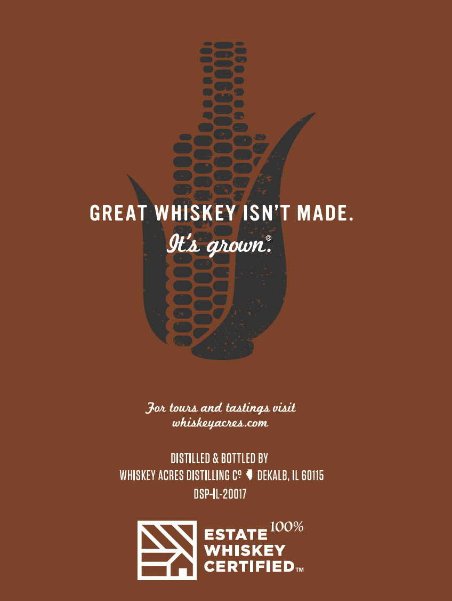
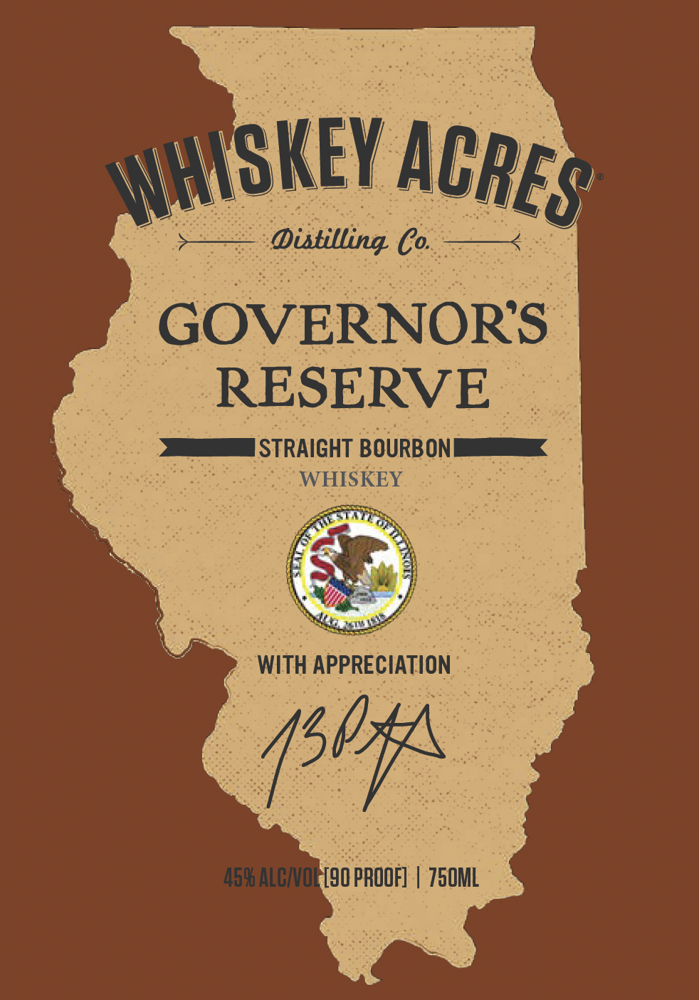

# TTB COLA Label Images - TTBID 26160001000893

**Brand Name:** WHISKEY ACRES DISTILLING CO.

**Issue Date:** 06/16/2026

**Origin Code:** 04

**Product Class/Type:** 101

**Source:** [TTB Public COLA Registry](https://ttbonline.gov/colasonline/viewColaDetails.do?action=publicFormDisplay&ttbid=26160001000893)

## Label Images

### Back Label

### Front Label

### Label 3

## Extracted Label Text

*Text extracted via OCR - may contain errors*

**Detected Proof:** 90

### Back Label

GREAT WHISKEY ISN'T MADE:
Its gown:
Joh touu and tastinga visit
whiskeyachea
com
distILLeD & bottled BV
whISKeV acRES DISTILLING C?
deKALB, IL 60115
DSP-IL-20017
10O%
ESTATE
WHISKEY
CERTIFIED

### Front Label

Distilling B
GOVERNORS
RESERVE
STRAIGHT BOURBONL
WHISKEY
WITH APPRECIATION
4596 AlCIOL [90 PROOF]
750ML
WHHSKEY
ACRES
4504

### Label 3

PE) EES JF
*slua|gold yljeay asned AeW pUe ‘ALaUIy9eW ajelado JO 129 e aALJp O fe InOA siiedwt

$aGesanag o1oyoofe JO Uo}dwWnsuog (2) "si9a}ap YiNIg JOYSL! Ay) Jo asnedag ADUEUBaLd BulINp saBelanaq
D1OYoo]e YUIIP JOU P[noys UAwWOM ‘Jelavag UOaBINg ay) o) Guypodoy (1) “ONINHVM LNSWNH3A09

>——————— Sava ¢ LSW31 LY d39y ——————<
