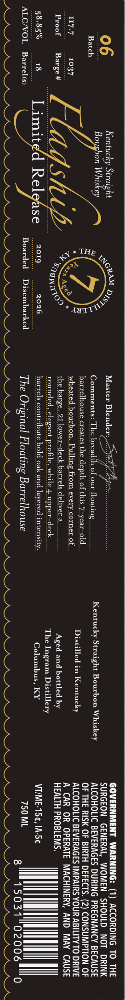

# TTB COLA Label Images - TTBID 26160001000965

**Brand Name:** OH INGRAM RIVER AGED

**Issue Date:** 07/17/2026

**Origin Code:** 43

**Product Class/Type:** 101

**Source:** [TTB Public COLA Registry](https://ttbonline.gov/colasonline/viewColaDetails.do?action=publicFormDisplay&ttbid=26160001000965)

## Label Images

### Front Label

## Extracted Label Text

*Text extracted via OCR - may contain errors*

**Detected Proof:** 74

### Front Label

06

Batch

117.7 1037

Proof Barge #

58.85% 18
ALC/VOL Barrel(s)

Kentucky Straight
Bougbon Whiskey

2019 2026
Boarded Disembarked

Master Blender: <)#4 Sly h ges

Comments: floating
barrelhouse creates the depth of this 7-year-old.
wheated bourbon. Pulling from every corner of
the barge, 21 lower-deck barrels deliver a...
rounded, elegant profile, while 4. upper-deck
barrels contribute bold oak and layered intensity.

The Original Floating Barrelhouse

Kentucky Straight Bourbon Whiskey
Distilled in Kentucky

Aged and bottled by
The Ingram Distillery
Columbus, KY

GOVERNMENT WARNING: (1) ACCORDING TO THE
SURGEON GENERAL, WOMEN SHOULD NOT DRINK
ALCOHOLIC BEVERAGES DURING PREGNANCY BECAUSE
OF THE RISK OF BIRTH DEFECTS. (2) CONSUMPTION OF
ALCOHOLIC BEVERAGES IMPAIRS YOUR ABILITY TO DRIVE
A CAR OR OPERATE MACHINERY, AND MAY CAUSE
HEALTH PROBLEMS. |

15031 02006

VI/ME-15¢, IA-5¢
750 ML
