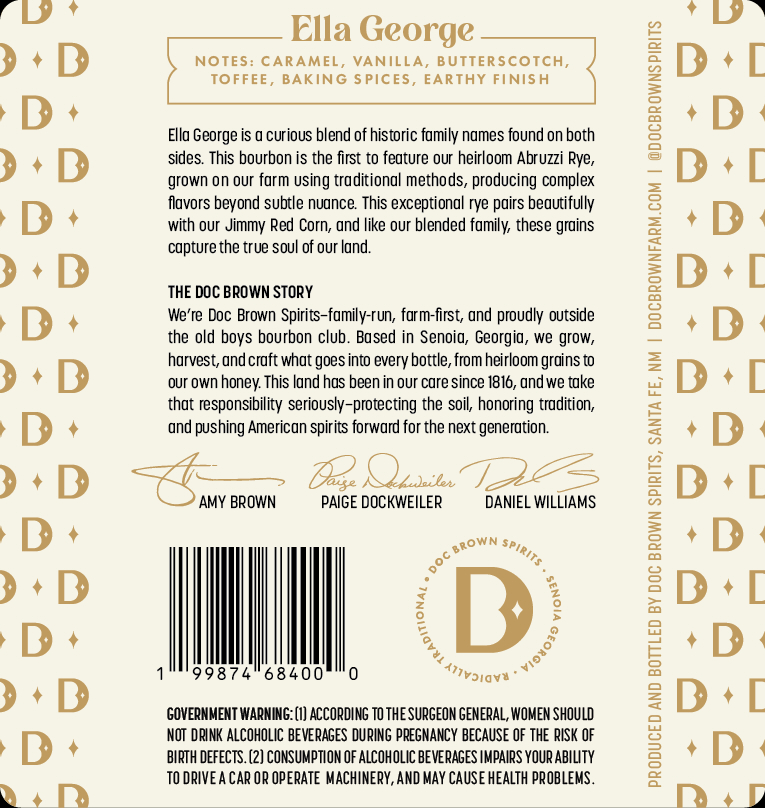
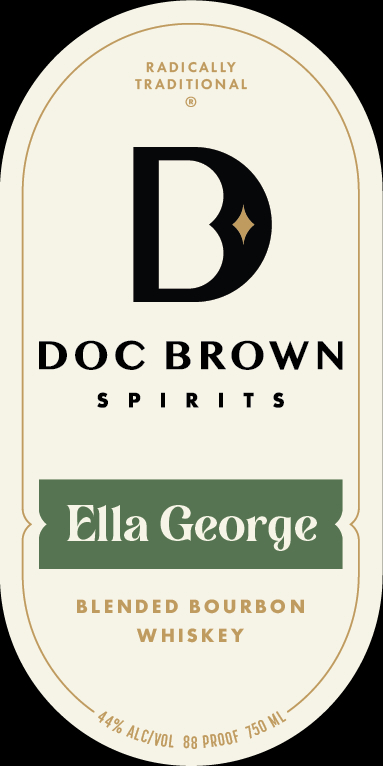

# TTB COLA Label Images - TTBID 26160001001023

**Brand Name:** ELLA GEORGE

**Issue Date:** 07/27/2026

**Origin Code:** 34

**Product Class/Type:** 131

**Source:** [TTB Public COLA Registry](https://ttbonline.gov/colasonline/viewColaDetails.do?action=publicFormDisplay&ttbid=26160001001023)

## Label Images

### Back Label

### Front Label

## Extracted Label Text

*Text extracted via OCR - may contain errors*

**Detected Proof:** 88

### Back Label

—___ Ella George —___

NOTES: CARAMEL, VANILLA, BUTTERSCOTCH,
TOFFEE, BAKING SPICES, EARTHY FINISH

Ella George is a curious blend of historic family names found on both
sides. This bourbon is the first to feature our heirloom Abruzzi Rye,
grown on our farm using traditional methods, producing complex
flavors beyond subtle nuance. This exceptional rye pairs beautifully
with our Jimmy Red Corn, and like our blended family, these grains
capture the true soul of our land.

THE DOC BROWN STORY

We're Doc Brown Spirits-family-run, farm-first, and proudly outside
the old boys bourbon club. Based in Senoia, Georgia, we grow,
harvest, and craft what goes into every bottle, from heirloom grains to
‘our own honey. This land has been in our care since 1816, and we take
that responsibility seriously-protecting the soil, honoring tradition,
and pushing American spirits forward for the next generation.

<3 Oe) cae (Ps
AMY BROWN PAIGEDOCKWEILER scene
” wae,
i +e
%, e
% o
8746840000 yaya"

GOVERNMENT WARNING: (1) ACCORDING TO THE SURGEON GENERAL, WOMEN SHOULD
NOT DRINK ALCOHOLIC BEVERAGES DURING PREGNANCY BECAUSE OF THE RISK OF
BIRTH DEFECTS. (2} CONSUMPTION OF ALCOHOLIC BEVERAGES IMPAIRS YOUR ABILITY
TODRIVEA CAR OR OPERATE MACHINERY, AND MAY CAUSE HEALTH PROBLEMS.

PRODUCED AND BOTTLED BY DOC BROWN SPIRITS, SANTA FE, NM | DOCBROWNFARM.COM | @DOCBROWNSPIRITS

### Front Label

RADICALLY
TRADITIONAL
B
DOC BROWN
5P | R | T $
Ella George
BLENDED BOURBON
WHISKEY
44%
750 WL
88
~alcivol
PROOF
