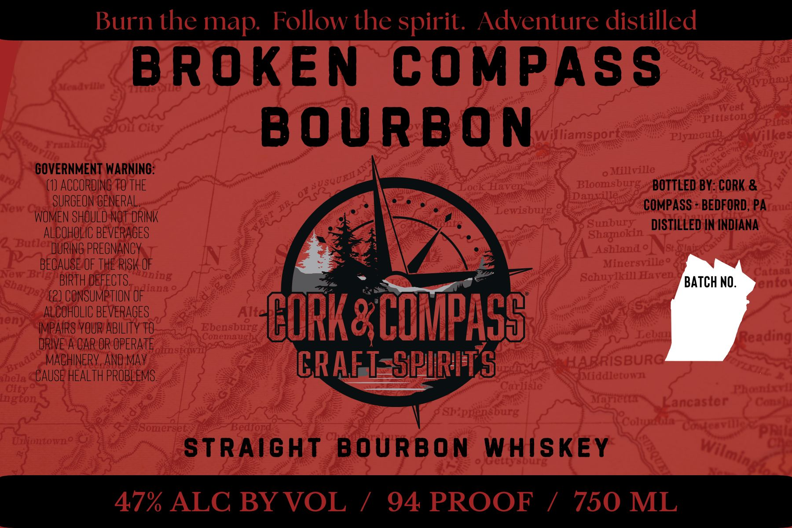

# TTB COLA Label Images - TTBID 26160001001068

**Brand Name:** CORK & COMPASS

**Fanciful Name:** BROKEN COMPASS BOURBON

**Issue Date:** 06/16/2026

**Origin Code:** 39

**Product Class/Type:** 101

**Source:** [TTB Public COLA Registry](https://ttbonline.gov/colasonline/viewColaDetails.do?action=publicFormDisplay&ttbid=26160001001068)

## Label Images

### Label 1

## Extracted Label Text

*Text extracted via OCR - may contain errors*

**Detected Proof:** 94

### Label 1

Burn the map:
Follow the spirit._Adventure distilled
BROKEN
COMPASS
West
Pittstono
Pitts
BoURBon
Williamsport
Plymoatl
Wilke
Aehley
GOVERNMENT WARNING:
Millville
(1) acCoRDING TO THE
Eock Haven
Bloomsburg
BOTTLED BY: CORK &
Dannlle
New (
SURGEON GENERAL;
Lewisbug
COMPASS
BEDFORD, PAraue
g
wOMEN SHOULD NOT DRINK
Sunbury
DISTILLED IN INDIANA
ALCOHOLIC BEVERAGES
Shagokin
Butle DURING PREGNANCY
Ashland 0
BECAUSE OF THE RISK OF
Minersvillet
Nab -
SchuylkilHaven
(2(nn4
BIRTH DEFECTS.
iana
BATCH NO.
ento
(2} Consumption OF
eny
IMEGISDUULREVEFGES_
Ebensbalg
CORK& COMPASS
Conemniug
la
Reading
DRIVE A CAR OR OPERATE
IIISLT
MACHINERY. AND May
CRAFT-SPURITS
HARRISBURC~
chela
CAUSE HEALTH PROBLEMS.
Mddletna
City
Garlisle
ataa
inxtoil
ancaster
"% )a
8
Shippensburg
&
Somersetr
Bedbfonar
pRil
hianittowa@
StRAight
BOURBON
Whiskey
Getstra
47% ALC BYVOL
7
94 PROOF
1
750 ML
1
~kl FII
Lr'/
Bnf
hning
shardsb
ruddt
Wilming
