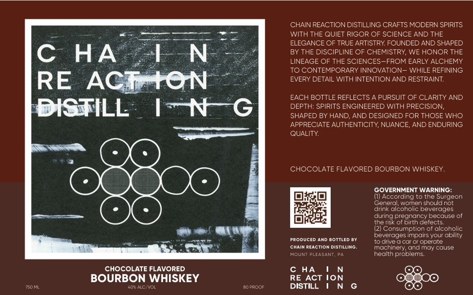

# TTB COLA Label Images - TTBID 26161001000010

**Brand Name:** CHAIN REACTION DISTILLING

**Fanciful Name:** CHOCOLATE FLAVORED BOURBON WHISKEY

**Issue Date:** 06/16/2026

**Origin Code:** 39

**Product Class/Type:** 149

**Source:** [TTB Public COLA Registry](https://ttbonline.gov/colasonline/viewColaDetails.do?action=publicFormDisplay&ttbid=26161001000010)

## Label Images

### Front Label

## Extracted Label Text

*Text extracted via OCR - may contain errors*

### Front Label

CHAIN REACTION DISTILLING CRAFTS MODERN SPIRITS
WITH THE QUIET RIGOR OF SCIENCE AND THE
ELEGANCE OF TRUE ARTISTRY FOUNDED AND SHAPED
C
HA
LN
BY THE DISCIPLINE OF CHEMISTRY, WE HONOR THE
LINEAGE OF THE SCIENCES-FROM EARLY ALCHEMY
TO CONTEMPORARY INNOVATION- WHILE REFINING
RE
ACIATON
EVERY DETAIL WITH INTENTIONAND RESTRAINT:
EACH BOTTLE REFLECTS
PURSUIT OF CLARITY AND
DISTILL
IN
G
DEPTH: SPIRITS ENGINEERED WITH PRECISION,
SHAPED BY HAND, AND DESIGNED FOR THOSE WHO
APPRECIATE AUTHENTICITY, NUANCE,; AND ENDURING
QUALITY:
CHOCOLATE FLAVORED BOURBON WHISKEY.
GOVERNMENT WARNING:
II) According to the Surgeon
Cenera; wcmen should not
drink alcoho
peverages
during
(pregindnce
because of
the risk of E
Celects:
(21 Consumption cf alcoholic
Ppoducec
AND BOTTLED BY
beverages impairs your ability
to drive
car Cr operate
CHAIN REACTION DISTILLING
machinery; andmay cause
MOUNT PLEASANT,
health problems
CHOCOLATE FLAVORED
c HA
BOURBON WHISKEY
RE ACT ION
USDl
40  ACol
BC PRCOF
DISTILL
