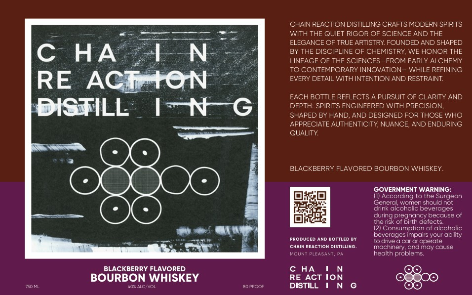

# TTB COLA Label Images - TTBID 26161001000012

**Brand Name:** CHAIN REACTION DISTILLING

**Fanciful Name:** BLACKBERRY FLAVORED BOURBON WHISKEY

**Issue Date:** 06/25/2026

**Origin Code:** 39

**Product Class/Type:** 149

**Source:** [TTB Public COLA Registry](https://ttbonline.gov/colasonline/viewColaDetails.do?action=publicFormDisplay&ttbid=26161001000012)

## Label Images

### Front Label

## Extracted Label Text

*Text extracted via OCR - may contain errors*

### Front Label

CHAIN REACTION DISTILLING CRAFTS MODERN SPIRITS
WITH THE QUIET RIGOR OF SCIENCE AND THE
ELEGANCE OF TRUE ARTISTRY FOUNDED AND SHAPED
C
HA
LN
BY THE DISCIPLINE OF CHEMISTRY, WE HONOR THE
LINEAGE OF THE SCIENCES-FROM EARLY ALCHEMY
TO CONTEMPORARY INNOVATION- WHILE REFINING
RE
ACTAtON
EVERY DETAIL
WITH INTENTION AND RESTRAINT:
EACH BOTTLE REFLECTS
PURSUIT OF CLARITY AND
DISTILL
IN
DEPTH: SPIRITS ENGINEERED WITH PRECISION,
SHAPED BY HAND
AND DESIGNED FOR THOSE WHO
APPRECIATE AUTHENTICITY;, NUANCE
AND ENDURING
QUALITY
BLACKBERRY FLAVORED BOURBON WHISKEY.
GOVERNMENT WARNING:
(1 According to the Surgeon
Ceneral, women should not
drink alcoholic beverages
during
(pregindnce
pecause of
the risk ot E
detects:
(21 Consumption of alcoholic
beverages impairs your ability
PRODUCED AND
BoTtLED BY
to ulive
car @r cperate
CHAIN REACTION DISTILLING.
macninery, andmay cause
MOUNT PLEASANT, Pa
health problems
BLACKBERRY FLAVORED
c HA
BOURBON WHISKEY
RE ACT ION
{SOML
402 ALCNVOL
BC PRCDi
DISTILL
