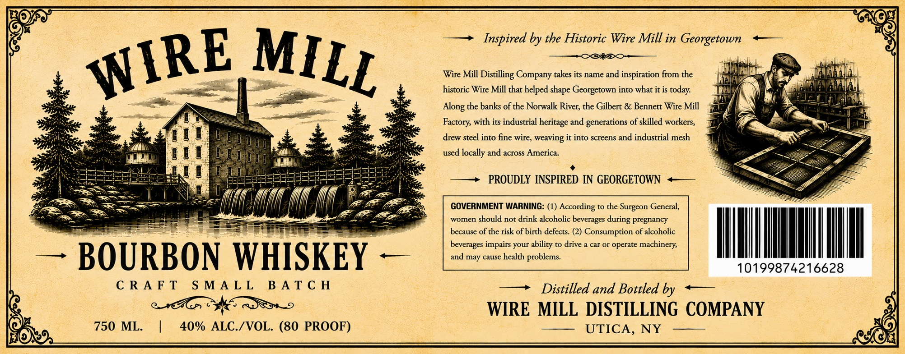

# TTB COLA Label Images - TTBID 26161001000056

**Brand Name:** WIRE MILL

**Issue Date:** 06/26/2026

**Origin Code:** 02

**Product Class/Type:** 141

**Source:** [TTB Public COLA Registry](https://ttbonline.gov/colasonline/viewColaDetails.do?action=publicFormDisplay&ttbid=26161001000056)

## Label Images

### Label 1

## Extracted Label Text

*Text extracted via OCR - may contain errors*

**Detected Proof:** 80

### Label 1

Inspired by the Historic Wire Mill in Georgetown
Wire Mill Distilling Company takes its name and inspiration from the
historic Wire Mill that helped
Georgetown into what it is today:
the banks of the Norwalk River; the Gilbert & Bennett Wire Mill
Factory, with its industrial
and generations of skilled workers,
drew steel
fine wire, weaving it into screens and industrial mesh
used locally and across America:
PROUDLY  INSPIRED IN GEORGETOWN
GOVERNMENT WARNING: (1)
According
the Surgeon General,
women
should not drink alcoholic beverages
pregnancy
because of the risk of birth defects: (2) Consumption of alcoholic
beverages impairs your
drive
car Or
operate machinery;
BOURBON WHISKEY
and
cause
health problems.
10199874216628
C R A F T
S M A L L
B A T € H
Distilled and Bottled by
WIRE MILL DISTILLING COMPANY
750 ML.
40% ALC /VOL. (80 PROOF)
UTICA, NY
WIRE
MILL
shape
Along
heritage
into
during
ability
may
