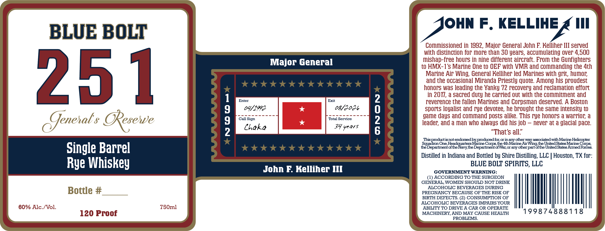

# TTB COLA Label Images - TTBID 26161001000068

**Brand Name:** BLUE BOLT

**Fanciful Name:** GENERAL'S RESERVE

**Issue Date:** 06/23/2026

**Origin Code:** 44

**Product Class/Type:** 142

**Source:** [TTB Public COLA Registry](https://ttbonline.gov/colasonline/viewColaDetails.do?action=publicFormDisplay&ttbid=26161001000068)

## Label Images

### Label 1

## Extracted Label Text

*Text extracted via OCR - may contain errors*

**Detected Proof:** 120
**Detected Age:** 30 Years

### Label 1

BLUE BOLT

oun F, KELLIHE £ Ill

Commissioned in 1992, Major General John F. Kelliher III served

with distinction for more than 30 years, accumulating over 4,500

mishap-free hours in nine different aircraft. From the Gunfighters

Major General

to HMX-1's Marine One to OEF with VMR and commanding the 4th

Marine Air Wing, General Kelliher led Marines with grit, humor,

and the occasional Miranda Priestly quote. Among his proudest

honors was leading the Yanky 72 recovery and reclamation effort

in 2017, a sacred duty he carried out with the commitment and

251

Enter

Exit

reverence the fallen Marines and Corpsman deserved. A Boston

O4f197)-

08/2036

sports loyalist and rye devotee, he brought the same intensity to

-----------

--------

game days and command posts alike. This rye honors a warrior, a

Resewe

Call Sign

Total Service

Chaka

FY years

leader, and a man who always did his job — never at a glacial pace

Generals Re §

That’s all.”

isnot endorsed

produced for, or inany other

Helicopter

the Department of the Navy, the Department

stquadton One,

One, Heacguarters Marine Corp

Corps, the 4th Marine Air’ ail

oe a See ent thes Union Soties Aneel Pores,

etre oes

Single Barrel

Distilled in Indiana and Bottled by Shire Distilling, LLC | Houston, TX for:

BLUE BOLT SPIRITS, LLG

Rye Whiskey

John F. Kelliher Ill

GOVERNMENT WARNING:

(1) ACCORDING TO THE SURGEON

GENERAL, WOMEN SHOULD NOT DRINK

ALCOHOLIC BEVERAGES DURING

Bottle #

PREGNANCY BECAUSE OF THE RISK OF

ALCOHOLIC BEVERAGES IMPAIRS YOUR

BIRTH DEFECTS. (2) CONSUMPTION OF

60% Alc./Vol

750ml

ABILITY TO DRIVE A CAR OR OPERATE

Mh

120 Proof

MACHINERY, AND MAY CAUSE HEALTH

199874888118

PROBLEMS.
