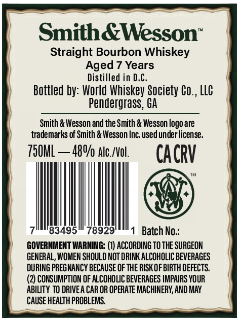
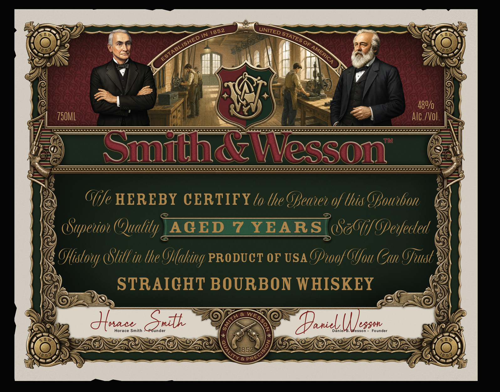
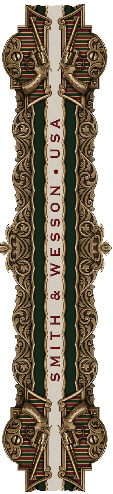

# TTB COLA Label Images - TTBID 26161001000117

**Brand Name:** SMITH & WESSON

**Issue Date:** 06/30/2026

**Origin Code:** 08

**Product Class/Type:** 101

**Source:** [TTB Public COLA Registry](https://ttbonline.gov/colasonline/viewColaDetails.do?action=publicFormDisplay&ttbid=26161001000117)

## Label Images

### Back Label

### Front Label

### Label 2

## Extracted Label Text

*Text extracted via OCR - may contain errors*

*1 image(s) excluded: text did not meet readability threshold*

**Detected Age:** 7 Years

### Back Label

Smith&Wesson
Straight Bourbon Whiskey
Aged 7 Years
Distilled in D.C
Bottled by: World Whiskey Society Co,, LLC
Pendergrass; GA
Smith & Wesson and theSmith & Wesson logoare
trademarks of Smith & Wesson Inc. used under license.
750ML
480/ Alc_/Vol.
CACRV
83495
78929
Batch No:
GOVERMMENT WARNING: (I) ACCORDING TO THE SURGEON
GENERAL, WOMEN SHOULD NOT DRINK ALCOHOLIC BEVERAGES
DURING PREGNANCY BECAUSE OF THE RISK OF BIRTH DEFECTS
(2) CONSUMPTION OF ALCOHOLIC BEVERAGES IMPAIRS YOUR
ABILTY TO DRIVEA CAR OR OPERATE MACHINERY, AND MAY
CAUSE HEALTH PROBLEMS:,

### Front Label

N
Of
480/0
750ML
Alc /Vol .
TM
SmhWesson
GGfe HEREBY CERTIFY to the Geavev of this GBotbon
Gupevov (Quality _
AGED
7
YEARS (cGfGperfected
Offstovy Gtill in the Gflaking PRODUCT OF USA Gpwoof Glou Can Gfust
STRAIGHT BOURBON WHISKEY
duac
Snith
anic (| les
Horace Smith
Founder
Danie_
esson
Founder
& PR
UNITED
1852
STATES
'ESTABLISHED
AMERICA
WES
