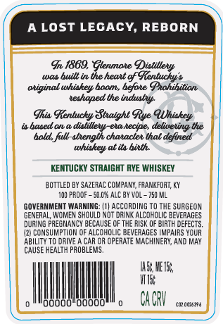
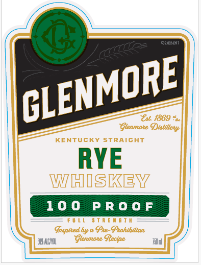

# TTB COLA Label Images - TTBID 26161001000141

**Brand Name:** GLENMORE

**Issue Date:** 06/16/2026

**Origin Code:** 22

**Product Class/Type:** 102

**Source:** [TTB Public COLA Registry](https://ttbonline.gov/colasonline/viewColaDetails.do?action=publicFormDisplay&ttbid=26161001000141)

## Label Images

### Back Label

### Front Label

## Extracted Label Text

*Text extracted via OCR - may contain errors*

### Back Label

A LOST LEGACY, REBORN
I 1869, Plenmote Diatiller
Wln
bullt ie the heatt gf GRentucky4
atiginal whiakey boames hefbte Onahihitian
teshaped the induatyt
Ihia Gentucky 8taight Gye
ubased an =
dislillett-eta kecipe, deliteting the
bald full-atength chatactet that defined
whiskey at ita bixth
KENTUCKY STRAIGHT RYE WHISKEY
BOTTLED BY SAZERAC CoMpanY, FRANKFORT; KY
PROOF _
E10R AlC By VOL _
150 ML
GOVERNMENT WARNING:
ACCORDING To ThE surgeon
GENERAL
WOMeN ShOUld NoT drImk ALCDHOLIC BEVERAGES
DURING PREGNANCY BECAUSE CF THE
RISK OF BIRTH DEFECTS
12) CONSuMptIon OF ALCOHOLIC BEVERAGES IMPAIRS YOUR
ABILITY TO Drive
Car Or OPERATE MachiNERY; ANd May
CAUSE HEALTH PROBLEMS
IE: HETER
UTIE
oooo"O0o00
CA GRV
cwdokmg
QUhiakey

### Front Label

uzodcn
Euc 1869
Ptenmote Oulillere
KenTucKY StraIGHT
RYE
WHISKEV
10 0
P R 0 0 F
LL
06 T H
Inapixed bw a Ge-Pahthttian
EX VCAZL
Gtenmoxe Gecipe
CLENMORE
